Blume rendert standardmäßiges Markdown und MDX mit einem kuratierten, GitHub-Flavored-Funktionsumfang — keine Imports, keine Konfiguration. Schreibe Inhalte so, wie du es ohnehin tust; diese Seite zeigt alles, was unterstützt wird, mit einer Live-Vorschau und dem Quelltext für jedes Element.

## Überschriften [#headings]

Gliedere eine Seite mit Überschriften. Blume rendert den `title` aus deinem Frontmatter als Seitenüberschrift, beginne deinen Inhalt also bei `##` — `##` und `###` werden zu Einträgen im Inhaltsverzeichnis. Eine Seite ohne `title` nimmt ihre erste `#`-Überschrift als Titel, und wenn die Seite mit dieser Überschrift beginnt, erscheint sie nur einmal, als Seitenüberschrift, die den Anker der Überschrift behält, sodass Links darauf weiterhin dort landen. Auch `llms-full.txt` führt sie nur einmal auf. Jede Überschrift von `##` bis `######` wird außerdem in einen Link auf ihren eigenen Anker eingefasst, sodass Leser eine Überschrift anklicken können, um einen Permalink direkt zu diesem Abschnitt zu kopieren, als Lesezeichen zu speichern oder zu teilen (mit dem Mauszeiger darüberfahren, um das `#` einzublenden). Schalte das mit `markdown: { headingAnchors: false }` in `blume.config.ts` ab.

```md
## Section

### Subsection

#### Detail
```

### Eigene Anker [#custom-anchors]

Anker-IDs werden aus dem Überschriftentext erzeugt, eine umformulierte Überschrift bekommt also einen neuen Anker. Ein `<Badge>` in einer Überschrift ist ein Label und kein Teil dieses Textes: `## Install <Badge>beta</Badge>` erhält den Anker `#install` und steht im Inhaltsverzeichnis als „Install“. Eine ID endet nie auf einem Bindestrich, `## Features ✨` erhält also den Anker `#features`, und eine Komponente oder ein Bild am Anfang oder Ende einer Überschrift fügt keinen Bindestrich hinzu. Hänge stattdessen `[#custom-id]` an, um den Anker festzunageln — der Marker wird nie gerendert, und Links funktionieren weiter, egal wie die Überschrift lautet. Festgenagelte Anker bleiben außerdem über [übersetzte Locales](/docs/content/i18n) hinweg identisch, wo automatisch erzeugte IDs sonst je Sprache abweichen würden.

```md
## Getting started [#setup]
```

Verlinke darauf als `/page#setup`. Die Syntax entspricht der von Fumadocs, migrierte Inhalte funktionieren also wortwörtlich.

Die von Pandoc, kramdown und Markdown-basierten Spezifikations-Toolchains verwendete Form `{#custom-id}` wird in `.md`-Dateien als gleichwertig akzeptiert. Nur diese Schreibweise ohne Leerzeichen nagelt einen Anker fest: Das `{ #custom-id }` mit Leerzeichen und das `{: #custom-id }` von kramdown (beide aus `attr_list` von MkDocs) sowie eine Attributliste, die die ID neben Klassen oder Attributen setzt (`{ #custom-id .wide }`), bleiben im Text der Überschrift und in ihrem Anker stehen, und `blume check` warnt in `.md` davor als `BLUME_MD_CURLY_ANCHOR`. In `.mdx` ist ein nacktes `{…}` ein JSX-Ausdruck und die Seite lässt sich nicht kompilieren — `blume check` meldet alle drei Schreibweisen als `BLUME_MDX_CURLY_ANCHOR` —, schreibe dort also `[#custom-id]` oder escape die geschweiften Klammern. Die escapte Form nagelt in beiden Formaten denselben Anker fest, was sie zur richtigen Schreibweise für ein Partial macht, das `.mdx`-Seiten [einbinden](/docs/content/includes):

```md
## Getting started \{#setup\}
```

Fragment-Links können auch auf ein rohes HTML-Element mit einer `id` (`<a id="setup"></a>`) oder auf ein `<a name="setup">` zeigen; `blume validate` akzeptiert diese neben Überschriften-Ankern.

Ein leeres `<a>` innerhalb einer Überschrift ist der eigene Anker der Überschrift, so wie GitBook-Exporte (`<a href="#setup" id="setup"></a>`) und Wikis (`<a name="setup"></a>`) ihn schreiben. Blume nimmt es aus der Überschrift heraus und gibt der Überschrift seine `id` oder andernfalls seinen `name`, sodass `#setup`-Links weiterhin dort landen und die Überschrift ihren eigenen Selbstlink behält. Ein `[#custom-id]`-Marker an derselben Überschrift hat Vorrang.

```md
## Getting started <a id="setup"></a>
```

### Inhaltsverzeichnis-Marker [#table-of-contents-markers]

Zwei weitere nachgestellte Marker steuern, wie eine Überschrift im Inhaltsverzeichnis erscheint. `[!toc]` behält eine Überschrift auf der Seite, hält sie aber aus dem Inhaltsverzeichnis heraus; `[toc]` macht das Gegenteil — die Überschrift erscheint nur im Inhaltsverzeichnis, als unsichtbares Ankerziel, was nützlich ist, um Abschnitte zu beschriften, die aus Komponenten statt aus Fließtext aufgebaut sind. Marker lassen sich in beliebiger Reihenfolge aneinanderreihen. Eine Ausnahme, geerbt von CommonMark: Eine nachgestellte Klammer, deren Label irgendwo auf der Seite eine Link-Referenzdefinition besitzt (`[toc]: /url`), ist ein Shortcut-Referenzlink und kein Marker — sie bleibt im Überschriftentext stehen.

```md
## Appears on the page only [!toc]

## Appears in the TOC only [toc]

## Both markers together [toc] [#custom-id]
```

Marker werden immer geparst — eine Überschrift, die wörtlich auf markerförmigen Text endet, würde als markiert behandelt. Escapen mit Backslash hilft nicht (Markdown löst `\[` zu `[` auf, bevor der Marker-Parse läuft); um wörtlichen Marker-Text am Ende einer Überschrift zu zeigen, packe ihn in Inline-Code: `` ## Using `[toc]` ``.

## Betonung [#emphasis]

Inline-Formatierung, um Wörter hervorzuheben, Löschungen zu kennzeichnen und Code oder Tastenanschläge mitten im Satz zu zeigen.

**Fett**, _kursiv_, ~~durchgestrichen~~ und `inline code`.

```md
**Bold**, _italic_, ~~strikethrough~~, and `inline code`.
```

## Tastaturtasten [#keyboard-keys]

Für Tastenkürzel und Tastenanschläge. Ein `<kbd>`-Element wird als dasselbe umrandete Tasten-Badge gerendert, das auch der Suchdialog verwendet — in Markdown, MDX und innerhalb von Komponenten wie `<Steps>` und `<Callout>`.

Drücke <kbd>⌘</kbd> <kbd>K</kbd>, um die Suche zu öffnen, oder <kbd>Esc</kbd>, um sie zu schließen.

```md
Press <kbd>⌘</kbd> <kbd>K</kbd> to open search, or <kbd>Esc</kbd> to close it.
```

## Hoch- und Tiefstellung [#superscript-and-subscript]

Für Fußnotenzeichen, Ordnungszahlen sowie wissenschaftliche oder chemische Notation im Fließtext.

E = mc^2^ und H~2~O.

{/* prettier-ignore */}
```md
E = mc^2^ and H~2~O.
```

## Blockzitate [#blockquotes]

Hebe ein Zitat, einen beiläufigen Hinweis oder eine redaktionelle Anmerkung vom umgebenden Text ab.

> Dokumentation, die schnell, KI-bereit und ohne Konfiguration auskommt — bis hin zum Template.

```md
> Documentation that's fast, AI-ready, and zero-config — down to the template.
```

## Listen [#lists]

Verwende ungeordnete Listen für ungeordnete Mengen, geordnete Listen für Abfolgen und Aufgabenlisten für Checklisten und Roadmaps.

- Markdown-first schreiben
- Standardmäßig statisch
  - Server-Funktionen optional aktivieren
- Deine Ausgabe gehört dir

1. Blume installieren
2. Eine Seite schreiben
3. Veröffentlichen

- [x] Projekt aufsetzen
- [ ] Erste Anleitung schreiben

```md
- Markdown-first authoring
- Static by default
  - Opt into server features
- Own your output

1. Install Blume
2. Write a page
3. Ship it

- [x] Scaffold the project
- [ ] Write the first guide
```

## Tabellen [#tables]

Stelle strukturierte Daten tabellarisch dar — Konfigurationsoptionen, Vergleichsmatrizen, Parameterlisten. Verwende Doppelpunkte in der Trennzeile, um Spalten auszurichten.

| Befehl        | Beschreibung             | Ausgabe |
| ------------- | ------------------------ | :-----: |
| `blume dev`   | Den Dev-Server starten   |    —    |
| `blume build` | Die statische Site bauen | `dist/` |

```md
| Command       | Description           | Output  |
| ------------- | --------------------- | :-----: |
| `blume dev`   | Start the dev server  |    —    |
| `blume build` | Build the static site | `dist/` |
```

Für eine Tabelle ohne Kopfzeile — zum Beispiel Schlüssel-Wert-Paare — lässt du die Kopfzellen leer. Markdown verlangt die Kopf- und Trennzeile syntaktisch, aber Blume entfernt den leeren Kopf aus der gerenderten Tabelle.

```md
|                |          |
| -------------- | -------- |
| Current status | E-3 visa |
```

## Links und Bilder [#links-and-images]

Verlinke auf andere Seiten oder externe Websites. Bilder akzeptieren einen relativen Pfad zu einer Datei neben deinem Inhalt, jeden Pfad unter `public/` (wird im Site-Root ausgeliefert) oder eine entfernte URL.

Ein relativer Seitenlink (`./install`, `../guides/setup`) wird vom eigenen Ordner der Seite aus aufgelöst — bei einer Index-Seite von dem Ordner, den sie einleitet —, und ein Link auf eine Markdown-Datei (`./setup.md`, `../intro.mdx`) landet auf der Seite, die diese Datei veröffentlicht, einschließlich ihres `slug`. Ein Seitenname mit Punkt (`./node.js` für eine `node.js.mdx`-Seite) zählt als Seitenlink, wenn dort eine Seite veröffentlicht wird, und ein String-`href` einer Komponente (`<Card href="./install">`) wird auf dieselbe Weise aufgelöst. Blume schreibt jeden dieser Links als root-relative Route in die gebaute Seite, sodass Links, die für GitHub oder Docusaurus geschrieben wurden, weiter funktionieren, und [`blume validate`](/docs/cli/validate) prüft sie auf dieselbe Weise.

Auch ein root-relativer Link auf eine Markdown-Datei (`/guides/setup.md`, so wie VitePress und Docsify ihn schreiben) landet auf der Seite dieser Datei, aufgelöst ab deinem Content-Root; unter einer [Deployment-`base`](/docs/deployment#subpath-deploys) wird ein Link, der mit der Base beginnt, so gelesen, als enthielte er sie. Ein Link, der keine Datei in deinen Inhalten benennt, behält seinen Pfad, denn `/guides/setup.md` ist auch die URL der [Markdown-Kopie](/docs/discoverability/markdown#raw-markdown) dieser Seite. Um auf die Markdown-Kopie einer Seite zu verlinken, egal wie ihre Datei heißt, schreibe ein rohes `<a href="/guides/setup.md">`, das seinen Pfad behält, oder die vollständige URL der Kopie.

Ein Link auf eine Markdown-Datei, die nicht existiert, probiert zuerst dieselbe Datei mit der jeweils anderen Endung. Nachdem du `setup.md` in `setup.mdx` umbenannt hast, landet ein Link auf `./setup.md` also weiterhin auf der Seite dieser Datei, einschließlich ihres `slug` und Sortierpräfixes, und `blume validate` lässt ihn durchgehen. Ein Link, der keine der beiden Dateien benennt, fällt auf einen einfachen relativen Link ohne Endung zurück. So oder so benennt der Link keine echte Datei mehr und bricht deshalb überall dort, wo das Markdown als Dateien gelesen wird, etwa auf GitHub. Passe die Endung in deinen Links an, wenn du eine Datei umbenennst.

Lies den [Schnellstart](/docs/quickstart), um loszulegen.

```md
Read the [quickstart](/docs/quickstart) to get started.


```

Externe Links öffnen sich standardmäßig im selben Tab. Setze `markdown: { externalLinks: true }` in `blume.config.ts`, um sie in einem neuen Tab zu öffnen, so wie es die Header- und Sidebar-Links von Blume bereits tun: Jeder absolute `https://`- oder `//host`-Link erhält `target="_blank"` und `rel="noreferrer"`, einen kleinen Pfeil nach seinem Text und einen Hinweis für Screenreader, dass er sich in einem neuen Tab öffnet. Links auf deine eigenen Seiten, `#fragments` sowie `mailto:`-/`tel:`-Links bleiben im Tab, ebenso ein rohes `<a>`-Tag, das die von dir geschriebenen Attribute behält.

**Bevorzuge relative Pfade für lokale Bilder** — sie werden beim Build optimiert: komprimiert, nach WebP konvertiert und mit intrinsischer `width`/`height` versehen, damit die Seite beim Laden nicht springt. Lege das Bild neben die Seite, die es verwendet (oder in einen gemeinsamen Ordner innerhalb deines Content-Verzeichnisses) und referenziere es relativ:

```md

```

Ein SVG, dessen Größe Astro nicht auslesen kann, wird unverändert ausgeliefert, statt den Build fehlschlagen zu lassen. Astro liest die Größe eines SVG aus seinem `<svg>`-Tag, das eine Breite und Höhe oder eine viewBox braucht und innerhalb der ersten 1.000 Bytes der Datei enden muss; ein draw.io-Export legt sein gesamtes Diagramm in einem `content`-Attribut auf diesem Tag ab, wodurch das Tag über diese Grenze hinausreicht. Blume warnt vor jedem solchen SVG als `BLUME_SVG_UNOPTIMIZED` an der Zeile, die es einbindet. Das Bild wird trotzdem angezeigt, allerdings ohne die intrinsische Größe, die ein optimiertes Bild mitbringt; exportiere das Diagramm ohne die Kopie seines Quelltexts oder entferne das `content`-Attribut, damit es optimiert wird.

Ein Link auf eine Datei neben deinen Inhalten, die keine Seite ist (`[the spec](./spec.pdf)`, `[data](../files/data.csv)` oder eine Referenzdefinition wie `[spec]: ./spec.pdf`), veröffentlicht diese Datei zusammen mit der Seite, und der gebaute Link zeigt auf die veröffentlichte Kopie und behält dabei ein Suffix wie `#page=2`. Dasselbe gilt für ein HTML-Element, das eine solche Datei benennt: das `src` eines ``, `<video>`, `<source>` oder `<audio>` und das `href` eines `<a>` oder einer Komponente wie `<Card>`, als rohes HTML in `.md` oder als Element in `.mdx`. Diese Kopien werden unverändert ausgeliefert, ohne die Optimierung, die ein eingebettetes Bild erhält. Ein relativer Link, der keine Datei neben der Seite benennt, behält seinen Pfad, sodass ein Link auf eine Datei unter `public/` weiterhin funktioniert.

Absolute Pfade unter `public/` (``) werden unverändert ausgeliefert, ohne Optimierung — nutze sie für Dateien, die ihre exakten Bytes und ihre URL behalten müssen, etwa ein Logo, das von außerhalb deiner Doku referenziert wird. Auch entfernte Bilder werden unangetastet durchgereicht, sofern ihr Host nicht in der [`image`-Konfiguration](/docs/configuration#images) autorisiert ist.

Inhaltsbilder sind standardmäßig per Klick zoombar — Leser können jedes Bild anklicken, um es in einer Lightbox zu öffnen. Schalte das mit `markdown: { imageZoom: false }` in `blume.config.ts` ab oder nimm ein einzelnes Bild mit `data-no-zoom` aus.

## Horizontale Linie [#horizontal-rule]

Trenne größere Themenwechsel innerhalb einer langen Seite.

---

```md
---
```

## Codeblöcke [#code-blocks]

Eingezäunte Codeblöcke werden syntaxhervorgehoben und erhalten eine Kopfzeile mit der Sprache — samt Markensymbol für erkannte Sprachen — sowie einen Kopieren-Button. Füge nach der Sprache einen **Titel** hinzu — typischerweise einen Dateinamen — und er ersetzt die Sprachbezeichnung in der Kopfzeile.

```ts blume.config.ts
import { defineConfig } from "blume";

export default defineConfig({
  title: "My docs",
});
```

````md
```ts blume.config.ts
import { defineConfig } from "blume";

export default defineConfig({
  title: "My docs",
});
```
````

Der Titel besteht aus allen Wörtern nach der Sprache, ` ```js Install the client ` gibt dem Block also den Titel „Install the client“. Schlüsselwörter wie `lineNumbers` und `wrap`, Zeilenbereiche wie `{1,4-5}` und `key="value"`-Optionen gehören nicht dazu, und `title="..."` setzt den Titel explizit. Ein Titel in eckigen Klammern wie ` ```ts [blume.config.ts] ` wird ohne diese angezeigt, und ein Zeilenbereich, der direkt an die Klammern anschließt, wie in ` ```ts [blume.config.ts]{2} `, hebt seine Zeilen trotzdem hervor.

Als Sprache taugt jede ID und jeder Alias einer [Shiki-Sprache](https://shiki.style/languages), in beliebiger Groß- und Kleinschreibung: ` ```JSON ` wird wie ` ```json ` hervorgehoben. Ein Block in einer Sprache, die Shiki nicht kennt, wird als reiner Text gerendert, und Blume warnt vor seinem Fence als `BLUME_UNKNOWN_CODE_LANGUAGE`; schreibe `text` für einen Block, der absichtlich reiner Text ist.

Optionen, die andere Doku-Tools auswerten, bewirken hier nichts, und Blume warnt vor jeder davon als `BLUME_CODE_FENCE_OPTION` und nennt die Schreibweise, die du stattdessen verwenden solltest: `hl_lines="2 3"` von MkDocs (hier ein `{2,3}`-Bereich) und `linenums="1"` (`lineNumbers`), `showLineNumbers` (`lineNumbers`), `lines` von Mintlify (`lineNumbers`), `wordWrap` von Fern (`wrap`) und `filename="app.js"` (`title="app.js"`). Bei einem Rust-Block lösen auch `ignore`, `no_run`, `should_panic`, `compile_fail`, `edition2015` bis `edition2024`, `noplayground` und `editable` von rustdoc und mdBook eine Warnung aus: Blume kompiliert, testet oder führt nie einen Codeblock aus, entferne sie also. Keine davon wird Teil des Titels.

Ein `console`-Block (oder `shellsession`-Block) ist eine Terminal-Sitzung: Befehle nach einem Prompt wie `$`, samt ihrer Ausgabe. Sein Kopieren-Button kopiert nur die Befehle, ohne ihre Prompts, sodass sich die Kopie direkt in ein Terminal einfügen lässt. Ein Befehl, der auf `\` endet, behält seine Fortsetzungszeilen.

```console
$ npm install blume
added 1 package in 2s
$ npx blume dev
```

Auch Inline-Code lässt sich hervorheben: Setze einen `{:lang}`-Marker in eine Backtick-Spanne, und sie wird wie ein winziger Codeblock eingefärbt — `useState(){:js}` oder `T extends object{:ts}`. Das greift nur, wenn du den Marker hinzufügst, sodass einfacher Inline-Code unberührt bleibt — nichts, was aktiviert werden müsste.

Die Hervorhebung nutzt standardmäßig die Themes `github-light`/`github-dark`. Tausche pro Farbmodus jedes [mitgelieferte Shiki-Theme](https://shiki.style/themes) über `markdown.code.theme` ein — es färbt alle Code-Oberflächen auf einmal (Fences, Inline-Snippets, `<CodeBlock>` und `<Diff>`):

```ts blume.config.ts
export default defineConfig({
  markdown: {
    code: {
      theme: { light: "github-light", dark: "vesper" },
    },
  },
});
```

Du kannst auch direkt eine eigene [Shiki-Theme-Definition](https://shiki.style/guide/load-theme) bereitstellen. Importiere eine VS-Code-kompatible Theme-JSON-Datei (mit einem Import-Attribut, falls deine Laufzeitumgebung eines verlangt) und weise sie einem der beiden Farbmodi zu; mitgelieferte Namen und eigene Definitionen lassen sich mischen:

```ts blume.config.ts
import darkTheme from "./themes/acme-dark.json" with { type: "json" };

export default defineConfig({
  markdown: {
    code: {
      theme: { light: "github-light", dark: darkTheme },
    },
  },
});
```

### Zeilennummern [#line-numbers]

Hänge `lineNumbers` an, um eine Zeilennummernspalte zu rendern — allein oder zusammen mit einem Titel:

```ts server.ts lineNumbers
import { createServer } from "node:http";

createServer().listen(3000);
```

````md
```ts server.ts lineNumbers
import { createServer } from "node:http";

createServer().listen(3000);
```
````

### Lange Zeilen und lange Blöcke [#long-lines-and-long-blocks]

Hänge `wrap` an, um die langen Zeilen eines einzelnen Blocks umbrechen zu lassen, statt sie seitlich zu scrollen:

```ts client.ts wrap
const client = createClient({
  baseUrl: "https://api.example.com/v1",
  retries: 3,
  timeout: 10_000,
  headers: { "x-client": "docs" },
});
```

````md
```ts client.ts wrap
const client = createClient({
  baseUrl: "https://api.example.com/v1",
  retries: 3,
  timeout: 10_000,
  headers: { "x-client": "docs" },
});
```
````

Hänge `expandable` an einen langen Block an, um nur seine ersten Zeilen mit einem Umschalter **Mehr anzeigen** darunter zu zeigen. Aufgeklappt wird der Block vollständig angezeigt, ohne darin zu scrollen. Ein Block mit weniger als 16 Zeilen wird wie gewohnt gerendert, da es kaum etwas zu verbergen gibt.

```ts routes.ts expandable
import { defineRoutes } from "./router";

export default defineRoutes({
  home: "/",
  docs: "/docs",
  guides: "/docs/guides",
  reference: "/docs/reference",
  changelog: "/changelog",
  blog: "/blog",
  pricing: "/pricing",
  about: "/about",
  careers: "/careers",
  contact: "/contact",
  privacy: "/legal/privacy",
  terms: "/legal/terms",
  security: "/security",
  status: "https://status.example.com",
});
```

````md
```ts routes.ts expandable
import { defineRoutes } from "./router";

export default defineRoutes({
  // …every route
});
```
````

Beide lassen sich mit einem Titel und `lineNumbers` kombinieren. Um jeden Block umbrechen zu lassen, setze stattdessen `markdown.code.wrap`.

### Hervorhebung [#highlighting]

Versieh Code mit Kommentaren im GitHub-Stil, um Aufmerksamkeit auf Zeilen, Wörter und Änderungen zu lenken. Die Kommentare werden aus der gerenderten Ausgabe entfernt, sodass der Code sauber kopierbar bleibt. Sie alle sind standardmäßig aktiv — keine Konfiguration nötig.

Markiere eine Zeile mit `// [!code highlight]`, um ihr einen hervorgehobenen Hintergrund zu geben:

```ts
const config = defineConfig({
  title: "My docs", // [!code highlight]
});
```

Zeige Änderungen mit `// [!code ++]` für Ergänzungen und `// [!code --]` für Entfernungen, gerendert als grün/rotes Diff:

```ts
export default defineConfig({
  title: "My docs", // [!code --]
  title: "Blume docs", // [!code ++]
});
```

Hebe jedes Vorkommen eines Begriffs in einer Zeile mit `// [!code word:createServer]` hervor:

```ts
import { createServer } from "node:http"; // [!code word:createServer]

createServer().listen(3000);
```

Kennzeichne eine Zeile mit `// [!code error]` oder `// [!code warning]` als Problem, rot beziehungsweise bernsteinfarben eingefärbt:

```ts
const port = process.env.PORT; // [!code warning]
server.listen(port.trim()); // [!code error]
```

Blende alles außer den mit `// [!code focus]` markierten Zeilen ab (der Rest wird beim Überfahren mit der Maus wieder scharf):

```ts
export default defineConfig({
  title: "My docs", // [!code focus]
  description: "Built with Blume",
});
```

Oder hebe Zeilen per **Nummer** statt per Kommentar hervor — nützlich, wenn du den Code nicht bearbeiten kannst. Setze einen Bereich in geschweiften Klammern hinter die Sprache, mit oder ohne Leerzeichen dazwischen (` ```ts{1,4-5} ` funktioniert auch); einzelne Zeilen, Kommalisten und `start-end`-Spannen funktionieren alle:

```ts {1,4-5}
import { defineConfig } from "blume";

export default defineConfig({
  title: "My docs",
  description: "Built with Blume",
});
```

````md
```ts {1,4-5}
import { defineConfig } from "blume";

export default defineConfig({
  title: "My docs",
  description: "Built with Blume",
});
```
````

### Anzeigetypen [#display-types]

Markiere einen TypeScript-Block mit `twoslash`, um echte Typen direkt aus dem Compiler anzuzeigen — ermöglicht durch [Twoslash](https://shiki.style/packages/twoslash). Fahre über ein beliebiges Token, um seinen abgeleiteten Typ zu sehen, und füge eine Inline-Abfrage `^?` hinzu, um einen Typ unter der Zeile anzuheften.

```ts twoslash
const config = {
  title: "My docs",
  version: 1,
};

config.title;
//     ^?
```

````md
```ts twoslash
const config = { title: "My docs", version: 1 };

config.title;
//     ^?
```
````

### TypeScript- und JavaScript-Tabs [#typescript-and-javascript-tabs]

Markiere einen `ts`- oder `tsx`-Block mit `ts2js`, um ihn als Tab-Paar zu rendern: dein TypeScript neben einer automatisch erzeugten JavaScript-Variante — so pflegst du ein einziges Snippet und Leser wählen ihren Dialekt. Die Umwandlung entfernt Typ-Syntax und reine Typ-Imports, behält deine Formatierung, Kommentare und JSX aber exakt so bei, wie du sie geschrieben hast — und die Tabs sind synchronisiert, sodass eine einmalige Wahl von JavaScript jedes Paar auf der Seite umschaltet. Wie Diagramme und Mathematik ist dies eine reine MDX-Funktion — in einer `.md`-Datei rendert der Block als schlichter TypeScript-Fence.

```ts ts2js
import { defineConfig } from "blume";

interface Author {
  name: string;
}

const author: Author = { name: "Hayden" };

export default defineConfig({
  title: `${author.name}'s docs`,
});
```

````md
```ts ts2js
import { defineConfig } from "blume";

interface Author {
  name: string;
}

const author: Author = { name: "Hayden" };

export default defineConfig({
  title: `${author.name}'s docs`,
});
```
````

Weitere Fence-Metaangaben lassen sich kombinieren: Ein `title="..."` erscheint auf beiden Tabs, während `{1,4-5}`-Zeilenbereiche nur für den TypeScript-Tab gelten (die Zeilennummern verschieben sich, sobald die Typen weg sind). Die einzige Ausnahme ist `twoslash` — Hover-Typen lassen sich nicht auf generierten Code übertragen, daher bleibt ein Fence, der beides trägt, ein schlichter Twoslash-Block.

:::note
Blende die Sprachsymbole aus oder lasse lange Zeilen umbrechen statt scrollen — mit `markdown: { code: { icons: false, wrap: true } }` in `blume.config.ts`.
:::

## Paketinstallation [#package-install]

Ein `package-install`-Block macht aus einem einzelnen Installationsbefehl ein Snippet mit Tabs für npm, pnpm, yarn, bun, nub und aube — so kopieren Leser genau den, der zu ihrem Setup passt. Wie Diagramme und Mathematik ist dies eine reine MDX-Funktion — in einer `.md`-Datei rendert der Block als schlichter Code-Fence.

```package-install
npm i blume
```

````md
```package-install
npm i blume
```
````

## Diagramme [#diagrams]

Ein `mermaid`-Block rendert ein [Mermaid](https://mermaid.js.org)-Diagramm direkt aus Text. Der Inhalt des Fences wird unverändert an Mermaid übergeben, sodass jeder von Mermaid unterstützte Diagrammtyp hier funktioniert. Diagramme folgen dem aktiven Farbthema und werden bei einem Wechsel neu gerendert. Erstelle eines, indem du den Quelltext mit `mermaid` einzäunst:

````md
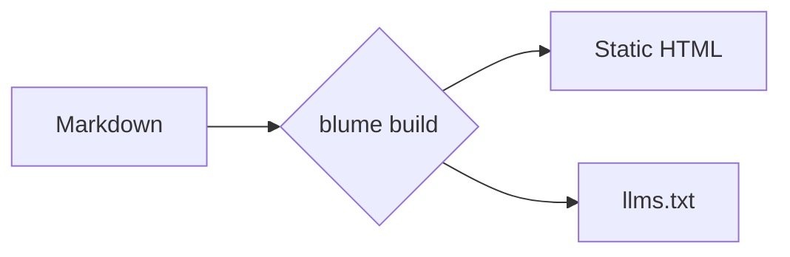
````

Diagramme werden im Client gerendert, daher ist dies eine reine MDX-Funktion, und die Mermaid-Bibliothek wird nur auf Seiten geladen, die eines enthalten; eine Site ohne Diagramm liefert sie überhaupt nicht aus. Diagramme verwenden standardmäßig das dagre-Layout und den klassischen Look von Mermaid; über Mermaid-Frontmatter (einen `config:`-Block mit `layout: elk` oder `look: neo`) stellst du ein einzelnes Diagramm auf ein anderes Layout oder einen anderen Look um, und die ELK-Engine wird nur für Diagramme geladen, die sie anfordern. Ein Diagramm, das Mermaid nicht parsen kann, zeigt an seiner Stelle „Could not render this diagram.“ an; der Parser-Fehler von Mermaid samt der Zeile, an der er stehen geblieben ist, landet in der Browser-Konsole, und `blume dev` gibt ihn zusätzlich unter der Meldung aus. Der Rest dieses Abschnitts ist eine Galerie gängiger Typen — die vollständige Liste findest du in der [Mermaid-Dokumentation](https://mermaid.js.org/intro/).

### Flussdiagramm [#flowchart]


### Sequenzdiagramm [#sequence-diagram]

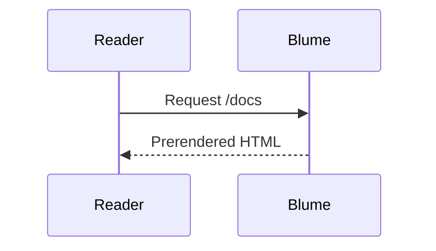

### Klassendiagramm [#class-diagram]

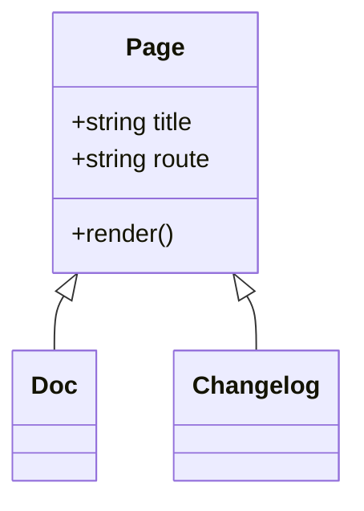

### Zustandsdiagramm [#state-diagram]

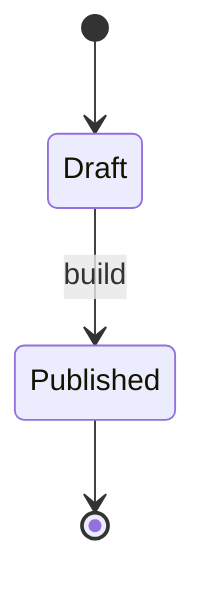

### Entity-Relationship

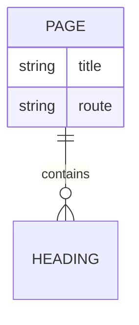

### User Journey

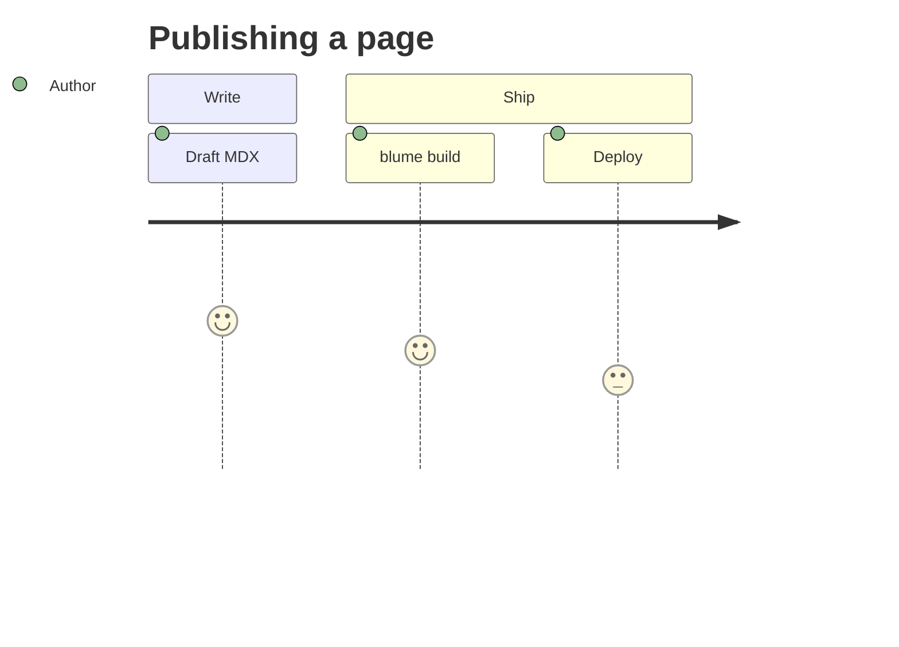

### Gantt

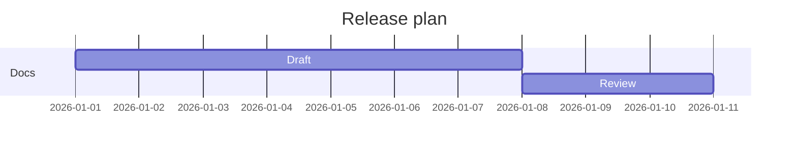

### Git-Graph

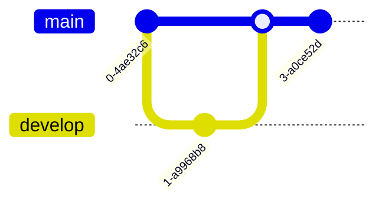

### Kreisdiagramm [#pie-chart]

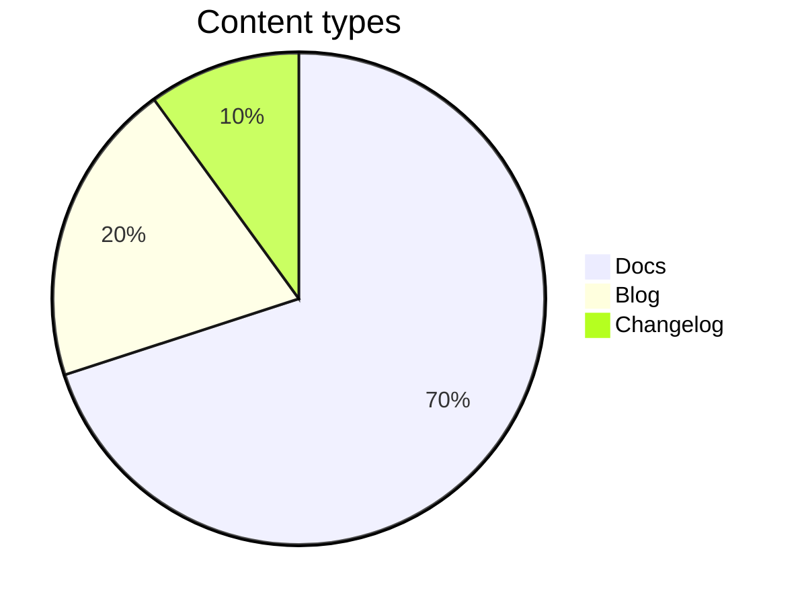

### Mindmap

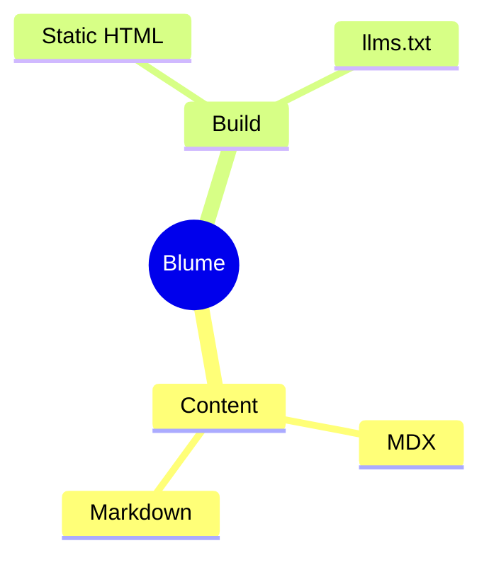

### Zeitstrahl [#timeline]

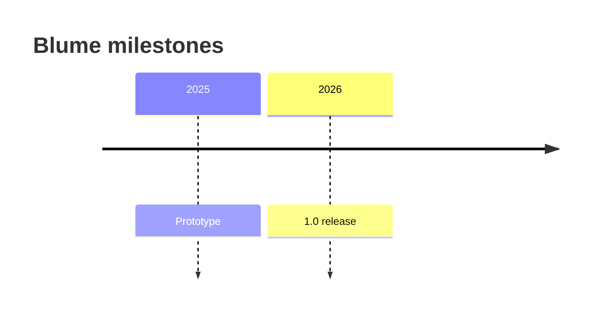

## Callouts

Callouts lenken die Aufmerksamkeit der Leser auf Kontext, Ratschläge oder Risiken. Schreibe sie als `:::type`-Direktiven; einen Titel fügst du in eckigen Klammern hinzu, etwa `:::warning[Heads up]`. Der Titel behält seine Inline-Formatierung, sodass Code, Betonung und Links in den Klammern im Titel gerendert werden. Direktiven sind eine reine MDX-Funktion — in einer `.md`-Datei bleibt eine `:::note`-Zeile wörtlicher Text, und `blume dev`, `blume build` und `blume check` warnen davor als `BLUME_MD_DIRECTIVE`. Benenne die Seite in `.mdx` um, damit die Direktive als Callout gerendert wird.

### Note

Neutraler, unterstützender Kontext, den der Leser im Hinterkopf behalten sollte.

:::note
Blume erzeugt `.blume/` bei jedem Lauf neu — bearbeite es niemals von Hand.
:::

```md
:::note
Blume regenerates `.blume/` on every run — never edit it by hand.
:::
```

### Tip

Eine hilfreiche Abkürzung oder Best Practice, die nicht erforderlich ist, das Leben aber leichter macht.

:::tip
Setze `deployment.site`, damit Sitemaps und Open-Graph-Bilder absolute URLs verwenden.
:::

```md
:::tip
Set `deployment.site` so sitemaps and Open Graph images use absolute URLs.
:::
```

### Success

Bestätige ein positives Ergebnis oder dass ein Schritt wie erwartet abgeschlossen wurde.

:::success
Deine Doku wurde erfolgreich gebaut und ist bereit zum Deployment.
:::

```md
:::success
Your docs built successfully and are ready to deploy.
:::
```

### Warning

Weise auf etwas hin, das Sorgfalt erfordert, um einen Fehler oder überraschendes Verhalten zu vermeiden.

:::warning[Achtung]
Die Server-Ausgabe benötigt einen Host-Adapter aus `blume/deploy`, bevor du deployen kannst.
:::

```md
:::warning[Heads up]
Server output needs a host adapter from `blume/deploy` before you can deploy.
:::
```

### Danger

Mache auf eine zerstörerische oder brechende Aktion aufmerksam, die sich nicht leicht rückgängig machen lässt.

:::danger
`blume eject` ist ein Einbahnstraßen-Schritt — das generierte Astro-Projekt gehört danach dir.
:::

```md
:::danger
`blume eject` is a one-way step — the generated Astro project becomes yours.
:::
```

### Info

Ein informativer Einschub; ein alias-freundlicher Standard, der neutral wirkt.

:::info
Das Kern-Theme liefert kein Client-Framework-JS aus.
:::

```md
:::info
The core theme ships no client framework JS.
:::
```

Die Namen `caution`, `error`, `important` und `warn` werden als Aliase für `warning`, `danger`, `note` beziehungsweise `warning` akzeptiert.

Jeder andere Name ist kein Callout. Sein Inhalt wird trotzdem gerendert — zwischen seinen `:::`-Zeilen, die so auf der Seite stehen bleiben, wie sie geschrieben wurden —, sodass ein aus einem anderen Doku-Tool übernommenes `:::details` oder ein Tippfehler wie `:::warnig` niemals verbirgt, was darin steht. `blume dev`, `blume build` und `blume check` warnen davor als `BLUME_UNKNOWN_DIRECTIVE` und nennen dabei die oben aufgeführten Callout-Typen.

Um ein Callout in ein anderes zu setzen, gib dem äußeren einen längeren Fence:

```md
::::note
Blume regenerates `.blume/` on every run.

:::tip
Commit `blume.config.ts`, not `.blume/`.
:::
::::
```

Schreibe den Namen direkt hinter die Doppelpunkte. `::: tip` mit Leerzeichen (die Schreibweise, die VitePress, VuePress und Docusaurus v2 verwenden) ist keine Direktive, die Seite zeigt die Zeile also als Text an, und Blume warnt vor einem so geschriebenen Callout-Namen als `BLUME_DIRECTIVE_SPACED_NAME`. Ein Titel gehört in eckige Klammern: Text nach dem Namen, wie in `:::tip Some title`, öffnet das Callout, wird aber nie angezeigt, und Blume warnt davor als `BLUME_DIRECTIVE_OPENING_TEXT` und nennt die Schreibweise mit Klammern, `:::tip[Some title]`. Innerhalb eines Containers schließt ein schließender Fence mit Text nach seinen Doppelpunkten diesen trotzdem, und der Text wird verworfen: Eine `::: card`-Zeile innerhalb eines `:::warning` beendet das Callout an dieser Stelle, und `card` wird nie angezeigt. Blume warnt vor dieser Zeile als `BLUME_DIRECTIVE_CLOSING_TEXT`. Um die Zeile als Text im Callout zu behalten, gib dem Callout wie oben einen längeren Fence oder entferne den Text nach den Doppelpunkten.

### GitHub-Alerts

Auch die Alert-Syntax von GitHub wird als Callout gerendert: ein Zitat, dessen erste Zeile `[!NOTE]`, `[!TIP]`, `[!IMPORTANT]`, `[!WARNING]` oder `[!CAUTION]` lautet, in beliebiger Groß- und Kleinschreibung. Text nach dem Marker in dieser Zeile wird zum Titel.

{/* prettier-ignore */}
> [!TIP]
> Setze `deployment.site`, damit Sitemaps und Open-Graph-Bilder absolute URLs verwenden.

{/* prettier-ignore */}
```md
> [!TIP]
> Set `deployment.site` so sitemaps and Open Graph images use absolute URLs.
```

`[!NOTE]` und `[!TIP]` werden als die gleichnamigen Callouts gerendert, `[!IMPORTANT]` als Note, `[!WARNING]` als Warning und `[!CAUTION]` als Danger-Callout, passend zum Rot von GitHub. Wie auf GitHub bleibt ein Alert, der innerhalb eines anderen zitiert wird, ein normales Zitat, und dasselbe gilt für jeden anderen Marker, etwa `[!INFO]`.

Ein Formatter, der Zeilen zusammenführt, etwa oxfmt mit `proseWrap: "never"`, zieht die erste Inhaltszeile neben den Marker hoch, wo sie zum Titel wird (auf dieselbe Weise [fasst er Direktiven zusammen](/docs/faq#why-is-oxfmt--ultracite-collapsing-my-directives)). Lass nach dem Marker eine `>`-Zeile leer, um beide getrennt zu halten; GitHub rendert auch diese Form.

Alerts sind wie Direktiven eine reine MDX-Funktion. In einer `.md`-Datei bleibt das Zitat ein Zitat und zeigt seinen Marker als Text an, und `blume dev`, `blume build` und `blume check` warnen davor als `BLUME_MD_GITHUB_ALERT`. Benenne die Seite in `.mdx` um, damit der Alert als Callout gerendert wird.

## Mathematik [#math]

Rendere LaTeX mit KaTeX — nützlich für mathematik- oder naturwissenschaftslastige Dokumentation. Setze `$$…$$` in eigene Zeilen, um einen zentrierten Block zu erhalten:

$$
\int_0^\infty e^{-x^2}\,dx = \frac{\sqrt{\pi}}{2}
$$

```md
$$
a^2 + b^2 = c^2
$$
```

Oder schreibe `$$…$$` mitten in einen Satz, um Inline-Mathematik zu erhalten, etwa die Eulersche Identität $$e^{i\pi} + 1 = 0$$:

```md
Like Euler's identity $$e^{i\pi} + 1 = 0$$.
```

:::note
Mathematik ist automatisch aktiv: Schreibe `$$…$$` und es wird gerendert; schreibst du keine, wird das Stylesheet von KaTeX nie ausgeliefert. Block- und Inline-Mathematik verwenden beide zwei Dollarzeichen. Ein einzelnes `$` (Währung, Shell-Variablen, Code) bleibt immer wörtlicher Text, sodass „$5 und $10“ nie zu Mathematik wird — es gibt also kein Trennzeichen zu escapen und keine Einstellung zum Umschalten. Mathematik ist eine reine MDX-Funktion. Die Klassennamen im gerenderten Markup (`.katex-html`, `.katex-base`, …) sind KaTeX-eigene Interna und kein Styling-Vertrag, den Blume pflegt — sie können sich bei einem KaTeX-Upgrade ändern, ziele für eigene Styles also auf den `.katex-display`-Wrapper.
:::

## Intelligente Interpunktion [#smart-punctuation]

Blume wandelt gerade Anführungszeichen und Bindestriche schon beim Schreiben in typografische Entsprechungen um, sodass Fließtext wirkt, als wäre er gesetzt worden — ohne Sonderzeichen.

"Anführungszeichen" werden typografisch, -- wird zu einem Halbgeviertstrich, --- zu einem Geviertstrich und ... zu Auslassungspunkten.

```md
"Quotes" become curly, -- becomes an en dash, --- an em dash, and ... an ellipsis.
```

## Syntax aus anderen Tools [#syntax-from-other-tools]

Blume liest die Syntax auf dieser Seite und sonst nichts. Syntax, die ein anderes Doku-Tool auswertet, erscheint so auf der Seite, wie sie geschrieben wurde, oder lässt eine `.mdx`-Seite beim Rendern scheitern, daher warnen `blume dev`, `blume build` und `blume check` an ihrer Zeile davor. Codeblöcke, Inline-Code und Kommentare werden übersprungen, packe ein Beispiel also in Inline-Code, um es als Text zu zeigen.

- `BLUME_TEMPLATE_TAG`: ein Liquid- oder Markdoc-Tag (``, ``) oder eine Liquid-Ausgabe (`{{ site.title }}`) in einer `.md`-Seite. Blume führt keine Template-Sprache aus, ersetze das Tag also durch das, was es erzeugt hat, und einen siteweiten Wert durch eine [Variable](/docs/content/variables). Ein `{{name}}`, das eine Variable sein könnte, wird hier nicht gemeldet.
- `BLUME_WIKILINK_UNSUPPORTED`: ein Wiki-Link (`[[Home]]`, `[[Text|Page]]`), der eine der Seiten der Site über ihren Dateinamen oder Titel benennt, oder jeder Wiki-Link mit einem `|`. Nur ein [Obsidian-Vault](/docs/content/sources/obsidian) als Quelle liest Wiki-Links. Die Warnung nennt den Markdown-Link, der ihn ersetzt.
- `BLUME_MDC_SYNTAX`: eine Block-Komponente (`::callout` … `::`) oder Inline-Komponente (`:badge[New]{color="primary"}`) von Nuxt Content (MDC). Verwende stattdessen die passende [Komponente](/docs/content/components) oder ein `:::`-Callout.
- `BLUME_MDX_ATTRIBUTE_LIST`: eine Attributliste (`{ width="300" }`, `{: .note }`) in einer `.mdx`-Seite. MDX liest die geschweiften Klammern als JavaScript, daher schlägt der Build der Seite fehl. Setze die Attribute stattdessen an einem JSX-Element (``) und nagle den Anker einer Überschrift mit `[#id]` fest.
- `BLUME_MD_ATTRIBUTE_LIST`: eine Attributliste in einer `.md`-Seite, etwa `{: .note }` oder `{: #intro }` von kramdown in einer eigenen Zeile oder nach einem Block, oder `{ width="300" }` nach einem Bild. Die Seite zeigt sie so an, wie sie geschrieben wurde. Setze die Attribute stattdessen an einem HTML-Element (``) und nagle den Anker einer Überschrift mit `[#id]` fest. Ein `{#id}`-Marker an einer Überschrift fällt stattdessen unter [`BLUME_MD_CURLY_ANCHOR`](#custom-anchors).
- `BLUME_MDX_UNCLOSED_ELEMENT`: ein leeres HTML-Element (Void-Element) ohne schließenden Schrägstrich (``, `<br>`) in einer `.mdx`-Seite oder in einem Partial, das eine `.mdx`-Seite [einbindet](/docs/content/includes). MDX liest es als nicht geschlossenes JSX-Element, schließe es also: `<br />`.
