Blume は、標準的な Markdown と MDX を、厳選された GitHub Flavored の機能セットでレンダリングします — インポートも設定も不要です。これまでどおりの書き方でコンテンツを書いてください。このページでは、サポートされているすべての機能を、ライブプレビューと各ソースとともに紹介します。

## 見出し [#headings]

見出しでページを構造化します。Blume はフロントマターの `title` をページ見出しとしてレンダリングするため、コンテンツは `##` から始めてください — `##` と `###` は目次の項目になります。`title` のないページは、最初の `#` 見出しをタイトルとして使います。ページがその見出しで始まる場合、見出しはページ見出しとして一度だけ表示され、その見出しのアンカーも保たれるため、そこへのリンクは引き続き機能します。`llms-full.txt` でも一度だけ記載されます。`##`〜`######` のすべての見出しは、それ自身のアンカーへのリンクでも囲まれるため、読者は見出しをクリックしてそのセクションへのパーマリンクをコピー、ブックマーク、共有できます（ホバーすると `#` が表示されます）。これをオフにするには、`blume.config.ts` で `markdown: { headingAnchors: false }` を指定します。

```md
## Section

### Subsection

#### Detail
```

### カスタムアンカー [#custom-anchors]

アンカーの id は見出しのテキストから生成されるため、見出しの文言を変えると新しいアンカーになります。見出し内の `<Badge>` はラベルであり、そのテキストの一部ではありません：`## Install <Badge>beta</Badge>` のアンカーは `#install` となり、目次には「Install」と表示されます。id がダッシュで終わることはないため、`## Features ✨` のアンカーは `#features` となり、見出しの先頭や末尾にあるコンポーネントや画像によってダッシュが追加されることもありません。代わりにアンカーを固定するには `[#custom-id]` を末尾に付けます — このマーカーはレンダリングされず、見出しの文言がどうなってもリンクは機能し続けます。固定したアンカーは[翻訳されたロケール](/docs/content/i18n)間でも同一のまま保たれます。自動生成された id では言語ごとに異なってしまうためです。

```md
## Getting started [#setup]
```

`/page#setup` としてリンクします。この構文は Fumadocs と一致するため、移行したコンテンツはそのまま動作します。id は書いたとおりにそのまま使われます：スマート句読点は見出しのテキスト内の `--` をダッシュに変換し、引用符を曲線的にしますが、マーカー内ではこれらを行わないため、`[#read--write]` のアンカーは `#read--write` となります。

Pandoc、kramdown、および Markdown ベースの仕様策定ツールチェーンで使われる `{#custom-id}` 形式は、`.md` ファイルでは同等のものとして受け付けられます。アンカーを固定するのは、このスペースを含まない書き方だけです：スペースを含む `{ #custom-id }` や kramdown の `{: #custom-id }`（どちらも MkDocs の `attr_list` に由来します）、そしてクラスや属性と並べて id を設定する属性リスト（`{ #custom-id .wide }`）は、見出しのテキストとそのアンカーにそのまま残り、`blume check` は `.md` においてこれらを `BLUME_MD_CURLY_ANCHOR` として警告します。`.mdx` では、裸の `{…}` は JSX 式となりページのコンパイルに失敗します — `blume check` はこれら 3 つの書き方をすべて `BLUME_MDX_CURLY_ANCHOR` として報告します — そのため、そこでは `[#custom-id]` と書くか、波括弧をエスケープしてください。エスケープした形式はどちらのフォーマットでも同じアンカーを固定するため、`.mdx` ページが[インクルード](/docs/content/includes)するパーシャルにはこの書き方が適しています：

```md
## Getting started \{#setup\}
```

フラグメントリンクは、`id` を持つ生の HTML 要素（`<a id="setup"></a>`）や `<a name="setup">` を対象にすることもできます。`blume validate` は見出しアンカーと並んでそれらも受け付けます。

見出し内の空の `<a>` は、GitBook のエクスポート（`<a href="#setup" id="setup"></a>`）や wiki（`<a name="setup"></a>`）の書き方と同様に、その見出し自身のアンカーとして扱われます。Blume はそれを見出しから取り除き、その `id`（なければ `name`）を見出しに与えるため、`#setup` へのリンクは引き続きそこに到達し、見出しも自身へのリンクを保ちます。同じ見出しに `[#custom-id]` マーカーがある場合は、そちらが優先されます。

```md
## Getting started <a id="setup"></a>
```

### 目次マーカー [#table-of-contents-markers]

さらに 2 つの末尾マーカーが、見出しを目次にどう表示するかを制御します。`[!toc]` は見出しをページ上に残しつつ目次からは除外します。`[toc]` はその逆で、見出しは目次にのみ表示され、ページ上では不可視のアンカーターゲットになります — 散文ではなくコンポーネントで構成されたセクションにラベルを付けるのに便利です。マーカーは任意の順序で連結できます。CommonMark から受け継いだ例外が 1 つあります：末尾の角括弧のラベルに対して、ページ内のどこかにリンク参照定義（`[toc]: /url`）がある場合、それはマーカーではなくショートカット参照リンクとなり、見出しのテキストに残ります。

```md
## Appears on the page only [!toc]

## Appears in the TOC only [toc]

## Both markers together [toc] [#custom-id]
```

マーカーは常に解析されます — 文字どおりマーカーの形をしたテキストで終わる見出しは、マーカー付きとして扱われます。バックスラッシュによるエスケープは役に立ちません（マーカーの解析が走る前に、Markdown が `\[` を `[` に解決するためです）。見出しの末尾にマーカーそのものの文字列を表示するには、インラインコードで囲んでください：`` ## Using `[toc]` ``。

## 強調 [#emphasis]

単語を強調したり、削除を示したり、文中でコードやキー入力を表示したりするためのインライン書式です。

**太字**、_斜体_、~~取り消し線~~、そして `inline code`。

```md
**Bold**, _italic_, ~~strikethrough~~, and `inline code`.
```

## キーボードキー [#keyboard-keys]

ショートカットやキー入力のために使います。`<kbd>` 要素は、検索ダイアログで使われているものと同じ枠線付きのキーバッジとしてレンダリングされます — Markdown、MDX、そして `<Steps>` や `<Callout>` のようなコンポーネントの内部でも同様です。

<kbd>⌘</kbd> <kbd>K</kbd> を押すと検索が開き、<kbd>Esc</kbd> を押すと閉じます。

```md
Press <kbd>⌘</kbd> <kbd>K</kbd> to open search, or <kbd>Esc</kbd> to close it.
```

## 上付き文字と下付き文字 [#superscript-and-subscript]

脚注記号、序数、そして科学表記や化学表記をインラインで表現するために使います。

E = mc^2^ と H~2~O。

{/* prettier-ignore */}
```md
E = mc^2^ and H~2~O.
```

## 引用 [#blockquotes]

引用、補足のコールアウト、編集上の注記を周囲の本文から切り離します。

> 高速で、AI に対応し、設定不要のドキュメント — テンプレートに至るまで。

```md
> Documentation that's fast, AI-ready, and zero-config — down to the template.
```

## リスト [#lists]

順序のない集合には箇条書きリスト、順序のある手順には番号付きリスト、チェックリストやロードマップにはタスクリストを使います。

- Markdown ファーストの執筆
- デフォルトで静的
  - サーバー機能はオプトイン
- 出力は自分のもの

1. Blume をインストールする
2. ページを書く
3. 公開する

- [x] プロジェクトの雛形を作成
- [ ] 最初のガイドを書く

```md
- Markdown-first authoring
- Static by default
  - Opt into server features
- Own your output

1. Install Blume
2. Write a page
3. Ship it

- [x] Scaffold the project
- [ ] Write the first guide
```

## テーブル [#tables]

設定オプション、比較表、パラメータ一覧といった構造化データを表にします。区切り行にコロンを使うと、列を揃えられます。

| コマンド      | 説明                   |  出力   |
| ------------- | ---------------------- | :-----: |
| `blume dev`   | 開発サーバーを起動する |    —    |
| `blume build` | 静的サイトをビルドする | `dist/` |

```md
| Command       | Description           | Output  |
| ------------- | --------------------- | :-----: |
| `blume dev`   | Start the dev server  |    —    |
| `blume build` | Build the static site | `dist/` |
```

ヘッダー行のないテーブル — 例えばキーと値の組 — が必要な場合は、ヘッダーのセルを空のままにします。Markdown は構文上ヘッダー行と区切り行を必要としますが、Blume はレンダリングされたテーブルから空のヘッダーを取り除きます。

```md
|                |          |
| -------------- | -------- |
| Current status | E-3 visa |
```

## リンクと画像 [#links-and-images]

他のページや外部サイトにリンクします。画像には、コンテンツの隣にあるファイルへの相対パス、`public/` 以下の任意のパス（サイトルートで配信されます）、またはリモート URL を指定できます。

相対ページリンク（`./install`、`../guides/setup`）は、そのページ自身のフォルダを基準に解決されます — インデックスページの場合は、そのページが紹介するフォルダが基準になります — また、Markdown ファイルへのリンク（`./setup.md`、`../intro.mdx`）は、そのファイルが公開するページ（`slug` も反映されます）に遷移します。ドットを含むページ名（`node.js.mdx` ページに対する `./node.js`）は、その場所でページが公開されていればページリンクとして扱われ、コンポーネントの文字列の `href`（`<Card href="./install">`）も同じように解決されます。Blume はビルドされたページでそれぞれをルート相対のパスとして書き出すため、GitHub や Docusaurus 向けに書かれたリンクもそのまま機能し、[`blume validate`](/docs/cli/validate) も同じ方法でそれらをチェックします。

Markdown ファイルへのルート相対リンク（VitePress や Docsify の書き方である `/guides/setup.md`）も、コンテンツのルートを基準に読み取られ、そのファイルのページに遷移します。[デプロイの `base`](/docs/deployment#subpath-deploys) を設定している場合、base で始まるリンクは base を含むものとして読み取られます。コンテンツ内のどのファイルも指していないリンクは、パスがそのまま保たれます。`/guides/setup.md` はそのページの [Markdown コピー](/docs/discoverability/markdown#raw-markdown)の URL でもあるためです。ファイル名に関係なくページの Markdown コピーにリンクするには、パスがそのまま保たれる生の `<a href="/guides/setup.md">` を書くか、コピーの完全な URL を書いてください。

存在しない Markdown ファイルへのリンクは、まずもう一方の拡張子を持つ同名のファイルを試します。そのため、`setup.md` を `setup.mdx` にリネームした後も、`./setup.md` へのリンクはそのファイルのページ（`slug` や順序付けのプレフィックスも反映されます）に遷移し、`blume validate` もそれを通過させます。どちらのファイルも指していないリンクは、拡張子を取り除いた通常の相対リンクにフォールバックします。いずれの場合も、そのリンクはもはや実在するファイルを指していないため、GitHub のように Markdown をファイルとして読む場所ではリンク切れになります。ファイルをリネームしたら、リンク内の拡張子も更新してください。

まずは[クイックスタート](/docs/quickstart)をお読みください。

```md
Read the [quickstart](/docs/quickstart) to get started.


```

外部リンクはデフォルトで同じタブで開きます。Blume のヘッダーやサイドバーのリンクと同じように新しいタブで開くには、`blume.config.ts` で `markdown: { externalLinks: true }` を指定します：`https://` または `//host` で始まるすべての絶対リンクに、`target="_blank"` と `rel="noreferrer"`、テキストの後ろの小さな矢印、そして新しいタブで開くことを伝えるスクリーンリーダー向けの注記が付与されます。自分のページへのリンク、`#fragments`、`mailto:`/`tel:` のリンクは同じタブで開き、生の `<a>` タグも同様です — こちらは書いたとおりの属性が保たれます。

**ローカル画像には相対パスを推奨します** — ビルド時に最適化されるためです：圧縮され、WebP に変換され、固有の `width`/`height` が付与されるので、読み込み中にページがずれません。画像はそれを使うページの隣（またはコンテンツディレクトリ内の共有フォルダ）に置き、相対パスで参照してください：

```md

```

Astro がサイズを読み取れない SVG は、ビルドを失敗させる代わりにそのまま配信されます。Astro は SVG のサイズを `<svg>` タグから読み取りますが、このタグには width と height、または viewBox が必要で、かつファイルの先頭 1,000 バイト以内で終わっている必要があります。draw.io のエクスポートは図全体をそのタグの `content` 属性に格納するため、タグがその範囲を超えてしまいます。Blume は、そうした SVG をそれぞれ埋め込んでいる行で `BLUME_SVG_UNOPTIMIZED` として警告します。画像は引き続き表示されますが、最適化された画像が持つ固有のサイズは付与されません。最適化させるには、ソースのコピーを含めずに図をエクスポートするか、`content` 属性を削除してください。

コンテンツの隣にあるページ以外のファイルへのリンク（`[the spec](./spec.pdf)`、`[data](../files/data.csv)`、または `[spec]: ./spec.pdf` のような参照定義）は、そのファイルをページとともに公開し、ビルドされたリンクは公開されたコピーを指します。`#page=2` のようなサフィックスも保たれます。そうしたファイルを指す HTML 要素も同様です：`.md` 内の生の HTML や `.mdx` 内の要素として書かれた、``、`<video>`、`<source>`、`<audio>` の `src`、および `<a>` や `<Card>` のようなコンポーネントの `href` が対象です。これらのコピーは、画像の埋め込みに適用される最適化なしでそのまま配信されます。ページの隣にあるどのファイルも指していない相対リンクはパスがそのまま保たれるため、`public/` 以下のファイルへのリンクも引き続き機能します。

`public/` 以下の絶対パス（``）は最適化なしでそのまま配信されます — ドキュメントの外から参照されるロゴのように、バイト列と URL を厳密に保つ必要があるファイルに使ってください。リモート画像も、そのホストが [`image` 設定](/docs/configuration#images)で許可されていない限り、手を加えずにそのまま渡されます。

コンテンツ内の画像はデフォルトでクリックしてズームできます — 読者は任意の画像をクリックしてライトボックスで開けます。これをオフにするには `blume.config.ts` で `markdown: { imageZoom: false }` を指定するか、`data-no-zoom` で個別の画像だけ除外します。

## 水平線 [#horizontal-rule]

長いページの中で、話題が大きく切り替わる箇所を区切ります。

---

```md
---
```

## コードブロック [#code-blocks]

フェンス付きコードブロックは構文ハイライトされ、言語を示すヘッダー（認識された言語にはブランドアイコン付き）とコピーボタンが表示されます。言語の後に**タイトル** — 通常はファイル名 — を追加すると、ヘッダーの言語ラベルの代わりに表示されます。

```ts blume.config.ts
import { defineConfig } from "blume";

export default defineConfig({
  title: "My docs",
});
```

````md
```ts blume.config.ts
import { defineConfig } from "blume";

export default defineConfig({
  title: "My docs",
});
```
````

タイトルは言語の後に続くすべての単語なので、` ```js Install the client ` はブロックに「Install the client」というタイトルを付けます。`lineNumbers` や `wrap` のようなキーワード、`{1,4-5}` のような行範囲、`key="value"` 形式のオプションはタイトルに含まれず、`title="..."` を使うとタイトルを明示的に設定できます。` ```ts [blume.config.ts] ` のように角括弧で囲んだタイトルは角括弧なしで表示され、` ```ts [blume.config.ts]{2} ` のように角括弧に続けて書いた行範囲も、引き続きその行をハイライトします。

言語には、任意の [Shiki 言語](https://shiki.style/languages)の id またはエイリアスを、大文字・小文字を問わず指定できます：` ```JSON ` は ` ```json ` と同じようにハイライトされます。Shiki が認識しない言語のブロックはプレーンテキストとしてレンダリングされ、Blume はそのフェンスを `BLUME_UNKNOWN_CODE_LANGUAGE` として警告します。意図的にプレーンテキストにしたいブロックには `text` と書いてください。

他のドキュメントツールが読み取るオプションはここでは何の効果もなく、Blume はそれぞれを `BLUME_CODE_FENCE_OPTION` として、代わりに使うべき書き方とともに警告します：MkDocs の `hl_lines="2 3"`（ここでは `{2,3}` の範囲）と `linenums="1"`（`lineNumbers`）、`showLineNumbers`（`lineNumbers`）、Mintlify の `lines`（`lineNumbers`）、Fern の `wordWrap`（`wrap`）、そして `filename="app.js"`（`title="app.js"`）です。Rust のブロックでは、rustdoc と mdBook の `ignore`、`no_run`、`should_panic`、`compile_fail`、`edition2015`〜`edition2024`、`noplayground`、`editable` も警告の対象です：Blume はコードブロックをコンパイル、テスト、実行することは一切ないため、これらは削除してください。いずれもタイトルの一部にはなりません。

`console`（または `shellsession`）ブロックはターミナルセッションを表します：`$` のようなプロンプトに続くコマンドと、その出力です。コピーボタンはプロンプトを除いたコマンドだけをコピーするため、そのままターミナルに貼り付けられます。`\` で終わるコマンドは、継続行も保持されます。

```console
$ npm install blume
added 1 package in 2s
$ npx blume dev
```

インラインコードもハイライトできます：バッククォートで囲んだ範囲の中に `{:lang}` マーカーを追加すると、小さなコードブロックのように色付けされます — `useState(){:js}` や `T extends object{:ts}` のように。マーカーを追加したときだけ有効になるので、通常のインラインコードはそのままです — 何かを有効にする必要はありません。

ハイライトはデフォルトで `github-light`/`github-dark` テーマを使います。`markdown.code.theme` を使えば、カラーモードごとに任意の[同梱 Shiki テーマ](https://shiki.style/themes)に差し替えられます — すべてのコード表示（フェンス、インラインスニペット、`<CodeBlock>`、`<Diff>`）が一度に色付けされます：

```ts blume.config.ts
export default defineConfig({
  markdown: {
    code: {
      theme: { light: "github-light", dark: "vesper" },
    },
  },
});
```

カスタムの [Shiki テーマ定義](https://shiki.style/guide/load-theme)を直接指定することもできます。VS Code 互換のテーマ JSON ファイルをインポートし（ランタイムが必要とする場合はインポート属性を使います）、いずれかのカラーモードに割り当ててください。同梱テーマ名とカスタム定義を混在させることもできます：

```ts blume.config.ts
import darkTheme from "./themes/acme-dark.json" with { type: "json" };

export default defineConfig({
  markdown: {
    code: {
      theme: { light: "github-light", dark: darkTheme },
    },
  },
});
```

### 行番号 [#line-numbers]

`lineNumbers` を付けると行番号の余白がレンダリングされます — 単独でも、タイトルと併用しても使えます：

```ts server.ts lineNumbers
import { createServer } from "node:http";

createServer().listen(3000);
```

````md
```ts server.ts lineNumbers
import { createServer } from "node:http";

createServer().listen(3000);
```
````

### 長い行と長いブロック [#long-lines-and-long-blocks]

`wrap` を付けると、そのブロックの長い行が横にスクロールする代わりに折り返されます：

```ts client.ts wrap
const client = createClient({
  baseUrl: "https://api.example.com/v1",
  retries: 3,
  timeout: 10_000,
  headers: { "x-client": "docs" },
});
```

````md
```ts client.ts wrap
const client = createClient({
  baseUrl: "https://api.example.com/v1",
  retries: 3,
  timeout: 10_000,
  headers: { "x-client": "docs" },
});
```
````

長いブロックに `expandable` を付けると、最初の数行だけが表示され、その下に **Show more** トグルが表示されます。開くとブロック全体が表示され、ブロック内でスクロールすることはありません。16 行未満のブロックは、隠す部分がほとんどないため通常どおりレンダリングされます。

```ts routes.ts expandable
import { defineRoutes } from "./router";

export default defineRoutes({
  home: "/",
  docs: "/docs",
  guides: "/docs/guides",
  reference: "/docs/reference",
  changelog: "/changelog",
  blog: "/blog",
  pricing: "/pricing",
  about: "/about",
  careers: "/careers",
  contact: "/contact",
  privacy: "/legal/privacy",
  terms: "/legal/terms",
  security: "/security",
  status: "https://status.example.com",
});
```

````md
```ts routes.ts expandable
import { defineRoutes } from "./router";

export default defineRoutes({
  // …every route
});
```
````

どちらもタイトルや `lineNumbers` と併用できます。すべてのブロックを折り返すには、代わりに `markdown.code.wrap` を設定します。

### ハイライト [#highlighting]

GitHub 形式のコメントでコードに注釈を付け、行・単語・変更点に注目を集めます。コメントはレンダリング結果から取り除かれるので、コードはコピー＆ペーストしてもきれいなままです。4 種類すべてデフォルトで有効です — 設定は不要です。

`// [!code highlight]` で行に印を付けると、その行の背景がハイライトされます：

```ts
const config = defineConfig({
  title: "My docs", // [!code highlight]
});
```

追加は `// [!code ++]`、削除は `// [!code --]` で変更を示すと、緑／赤の差分としてレンダリングされます：

```ts
export default defineConfig({
  title: "My docs", // [!code --]
  title: "Blume docs", // [!code ++]
});
```

`// [!code word:createServer]` で、行内のある語のすべての出現箇所をハイライトします：

```ts
import { createServer } from "node:http"; // [!code word:createServer]

createServer().listen(3000);
```

`// [!code error]` または `// [!code warning]` で行を問題箇所として示すと、それぞれ赤と琥珀色で着色されます：

```ts
const port = process.env.PORT; // [!code warning]
server.listen(port.trim()); // [!code error]
```

`// [!code focus]` で印を付けた行以外をすべて暗くします（残りはホバーすると鮮明になります）：

```ts
export default defineConfig({
  title: "My docs", // [!code focus]
  description: "Built with Blume",
});
```

または、コメントの代わりに**行番号**で行をハイライトすることもできます — コードを編集できない場合に便利です。言語の後に波括弧で範囲を書きます。間にスペースを入れても入れなくても構いません（` ```ts{1,4-5} ` でも動作します）。単一行、カンマ区切りのリスト、`start-end` の範囲がすべて使えます：

```ts {1,4-5}
import { defineConfig } from "blume";

export default defineConfig({
  title: "My docs",
  description: "Built with Blume",
});
```

````md
```ts {1,4-5}
import { defineConfig } from "blume";

export default defineConfig({
  title: "My docs",
  description: "Built with Blume",
});
```
````

### 表示タイプ [#display-types]

TypeScript のブロックに `twoslash` を付けると、コンパイラから直接得られた実際の型が表示されます — [Twoslash](https://shiki.style/packages/twoslash) によるものです。任意のトークンにホバーすると推論された型が表示され、インラインの `^?` クエリを追加すると、その行の下に型を固定表示できます。

```ts twoslash
const config = {
  title: "My docs",
  version: 1,
};

config.title;
//     ^?
```

````md
```ts twoslash
const config = { title: "My docs", version: 1 };

config.title;
//     ^?
```
````

### TypeScript と JavaScript のタブ [#typescript-and-javascript-tabs]

`ts` または `tsx` のブロックに `ts2js` を付けると、タブの組としてレンダリングされます：あなたの TypeScript と、自動生成された JavaScript 版が並ぶので、スニペットは 1 つだけ保守すれば、読者は自分の方言を選べます。変換では型構文と型のみのインポートが取り除かれ、書式・コメント・JSX は書いたとおりに保たれます — さらにタブは同期するため、一度 JavaScript を選ぶとページ上のすべての組が切り替わります。図表や数式と同様に、これは MDX 専用の機能です — `.md` ファイルではこのブロックは通常の TypeScript フェンスとしてレンダリングされます。

```ts ts2js
import { defineConfig } from "blume";

interface Author {
  name: string;
}

const author: Author = { name: "Hayden" };

export default defineConfig({
  title: `${author.name}'s docs`,
});
```

````md
```ts ts2js
import { defineConfig } from "blume";

interface Author {
  name: string;
}

const author: Author = { name: "Hayden" };

export default defineConfig({
  title: `${author.name}'s docs`,
});
```
````

その他のフェンスのメタ情報も組み合わせられます：`title="..."` は両方のタブに表示され、`{1,4-5}` の行範囲は TypeScript のタブにのみ適用されます（型がなくなると行番号がずれるためです）。唯一の例外は `twoslash` です — ホバー時の型は生成されたコードには引き継げないため、両方を付けたフェンスは通常の Twoslash ブロックのままになります。

:::note
言語アイコンを非表示にしたり、長い行をスクロールさせる代わりに折り返したりするには、`blume.config.ts` で `markdown: { code: { icons: false, wrap: true } }` を指定します。
:::

## パッケージインストール [#package-install]

`package-install` ブロックは、1 つのインストールコマンドを npm、pnpm、yarn、bun、nub、aube のタブ付きスニペットに変換します — 読者は自分の環境に合ったものをコピーできます。図表や数式と同様に、これは MDX 専用の機能です — `.md` ファイルではこのブロックは通常のコードフェンスとしてレンダリングされます。

```package-install
npm i blume
```

````md
```package-install
npm i blume
```
````

## 図表 [#diagrams]

`mermaid` ブロックは、テキストから直接 [Mermaid](https://mermaid.js.org) の図をレンダリングします。フェンスの内容はそのまま Mermaid に渡されるため、Mermaid がサポートするあらゆる図の種類がここで使えます。図はアクティブなカラーテーマに従い、テーマが変わると再レンダリングされます。ソースを `mermaid` でフェンスして記述します：

````md
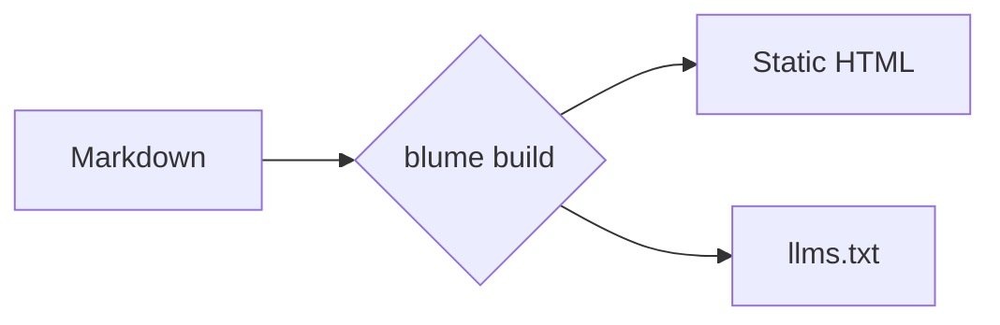
````

図はクライアント側でレンダリングされるため、これは MDX 専用の機能であり、Mermaid ライブラリは図を含むページでのみ読み込まれます。図が 1 つもないサイトでは、ライブラリはまったく配信されません。図はデフォルトで Mermaid の dagre レイアウトと classic の外観を使います。Mermaid のフロントマター（`layout: elk` や `look: neo` を指定した `config:` ブロック）を使えば、個別の図だけを別のレイアウトや外観に切り替えられます。ELK エンジンは、それを要求する図に対してのみ読み込まれます。Mermaid が解析できない図は、その場所に「Could not render this diagram.」と表示されます。Mermaid のパーサーエラーは、解析が止まった行とともにブラウザのコンソールに出力され、`blume dev` ではそのメッセージの下にも表示されます。このセクションの残りは代表的な種類のギャラリーです — 全一覧は [Mermaid のドキュメント](https://mermaid.js.org/intro/)を参照してください。

### フローチャート [#flowchart]


### シーケンス図 [#sequence-diagram]

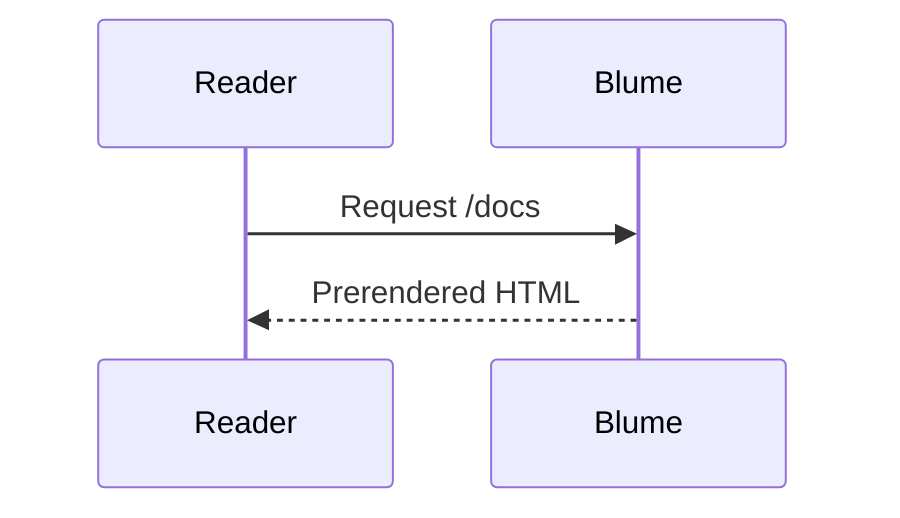

### クラス図 [#class-diagram]

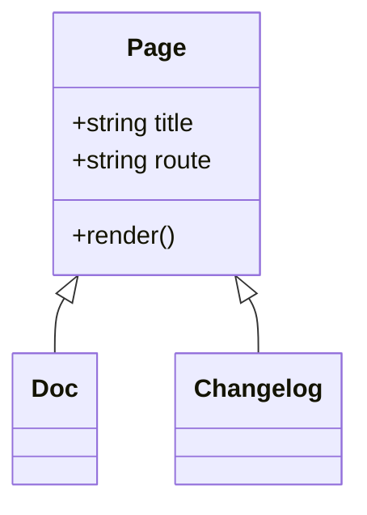

### 状態遷移図 [#state-diagram]

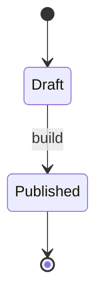

### ER 図 [#entity-relationship]

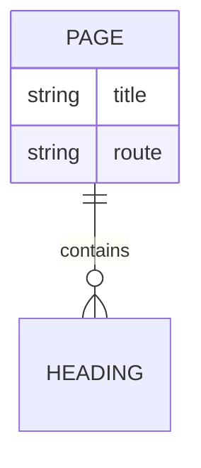

### ユーザージャーニー [#user-journey]

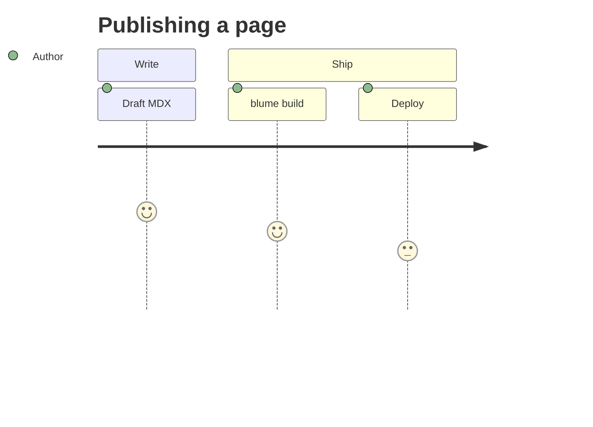

### ガントチャート [#gantt]

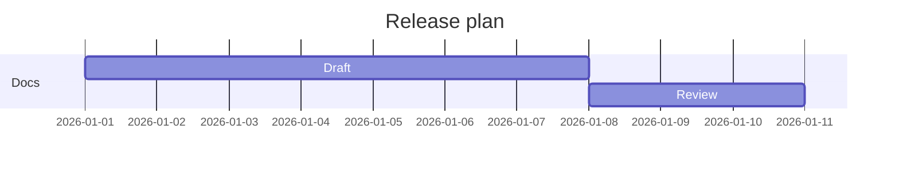

### Git グラフ [#git-graph]

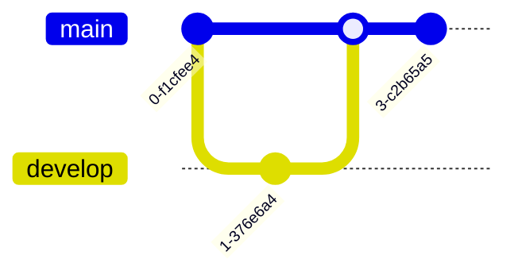

### 円グラフ [#pie-chart]

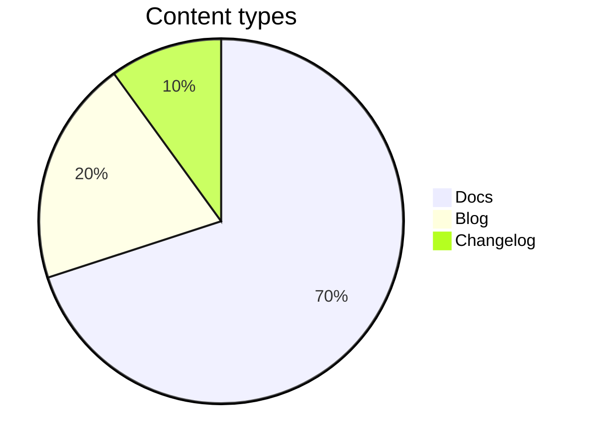

### マインドマップ [#mindmap]

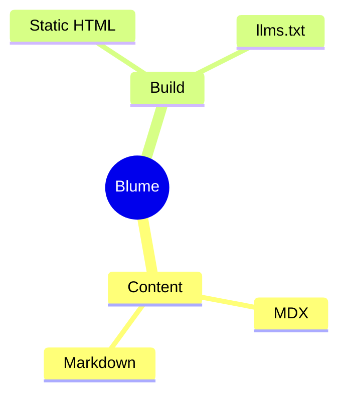

### タイムライン [#timeline]

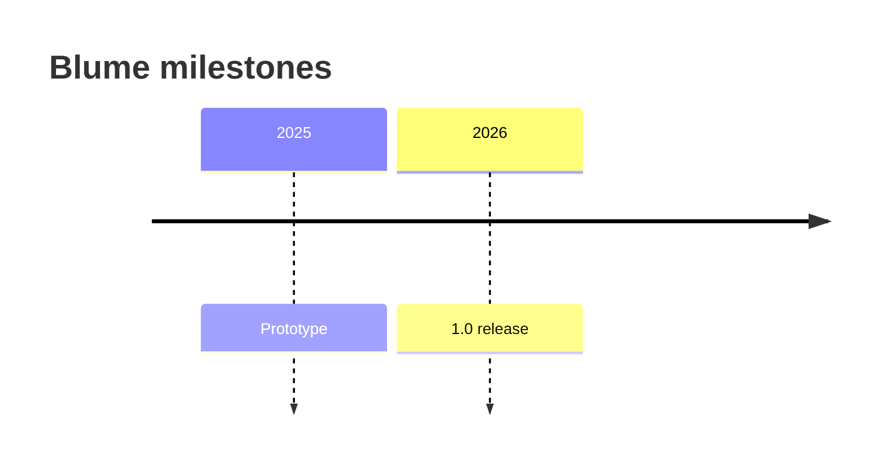

## コールアウト [#callouts]

コールアウトは、背景情報・助言・リスクに読者の注意を向けます。`:::type` ディレクティブとして書き、`:::warning[Heads up]` のように角括弧でタイトルを追加できます。タイトルではインラインの書式が保たれるため、角括弧内のコード、強調、リンクはタイトル内でそのままレンダリングされます。ディレクティブは MDX 専用の機能です — `.md` ファイルでは `:::note` の行はそのまま文字列として残り、`blume dev`、`blume build`、`blume check` はこれを `BLUME_MD_DIRECTIVE` として警告します。コールアウトとしてレンダリングするには、ページを `.mdx` にリネームしてください。

### Note

読者が心に留めておくべき、中立的な補足情報です。

:::note
Blume は実行のたびに `.blume/` を再生成します — 手動で編集しないでください。
:::

```md
:::note
Blume regenerates `.blume/` on every run — never edit it by hand.
:::
```

### Tip

必須ではないものの、作業を楽にしてくれる便利な近道やベストプラクティスです。

:::tip
`deployment.site` を設定すると、サイトマップと Open Graph 画像が絶対 URL を使うようになります。
:::

```md
:::tip
Set `deployment.site` so sitemaps and Open Graph images use absolute URLs.
:::
```

### Success

良好な結果や、手順が期待どおりに完了したことを伝えます。

:::success
ドキュメントのビルドに成功し、デプロイの準備が整いました。
:::

```md
:::success
Your docs built successfully and are ready to deploy.
:::
```

### Warning

ミスや予想外の挙動を避けるために注意が必要な点を示します。

:::warning[ご注意]
サーバー出力をデプロイするには、事前に `blume/deploy` のホストアダプターが必要です。
:::

```md
:::warning[Heads up]
Server output needs a host adapter from `blume/deploy` before you can deploy.
:::
```

### Danger

簡単には元に戻せない、破壊的または破壊的変更を伴う操作を警告します。

:::danger
`blume eject` は一方通行の手順です — 生成された Astro プロジェクトはあなたのものになります。
:::

```md
:::danger
`blume eject` is a one-way step — the generated Astro project becomes yours.
:::
```

### Info

情報提供のための補足です。中立的に読める、エイリアスにも使いやすいデフォルトです。

:::info
コアテーマにはクライアントフレームワークの JS は含まれません。
:::

```md
:::info
The core theme ships no client framework JS.
:::
```

`caution`、`error`、`important`、`warn` という名前は、それぞれ `warning`、`danger`、`note`、`warning` のエイリアスとして使えます。

それ以外の名前はコールアウトにはなりません。その場合も内容はレンダリングされ、前後の `:::` の行も書いたとおりページ上に残ります。そのため、他のドキュメントツールから持ち込んだ `:::details` や、`:::warnig` のようなタイプミスがあっても、中身が隠れてしまうことはありません。`blume dev`、`blume build`、`blume check` は、これを `BLUME_UNKNOWN_DIRECTIVE` として警告し、上記のコールアウトの種類を案内します。

コールアウトを別のコールアウトの中に入れるには、外側のコールアウトにより長いフェンスを使います：

```md
::::note
Blume regenerates `.blume/` on every run.

:::tip
Commit `blume.config.ts`, not `.blume/`.
:::
::::
```

名前はコロンの直後に書いてください。スペースを挟んだ `::: tip`（VitePress、VuePress、Docusaurus v2 で使われる書き方）はディレクティブではないため、その行はページ上にテキストとして表示されます。Blume は、このように書かれたコールアウト名を `BLUME_DIRECTIVE_SPACED_NAME` として警告します。タイトルは角括弧で囲みます：`:::tip Some title` のように名前の後ろに書いたテキストはコールアウトを開きますが表示されることはなく、Blume はこれを `BLUME_DIRECTIVE_OPENING_TEXT` として、角括弧を使った書き方 `:::tip[Some title]` とともに警告します。コンテナの内部では、コロンの後ろにテキストがある閉じフェンスでもコンテナは閉じられ、そのテキストは破棄されます：`:::warning` の中にある `::: card` の行はそこでコールアウトを終了させ、`card` は表示されません。Blume はその行を `BLUME_DIRECTIVE_CLOSING_TEXT` として警告します。その行をテキストとしてコールアウトの中に残すには、上記のようにコールアウトにより長いフェンスを使うか、コロンの後ろのテキストを削除してください。

### GitHub アラート [#github-alerts]

GitHub のアラート構文もコールアウトとしてレンダリングされます：最初の行が `[!NOTE]`、`[!TIP]`、`[!IMPORTANT]`、`[!WARNING]`、`[!CAUTION]` のいずれか（大文字・小文字は問いません）である引用です。その行でマーカーの後ろに続くテキストはタイトルになります。

{/* prettier-ignore */}
> [!TIP]
> `deployment.site` を設定すると、サイトマップと Open Graph 画像が絶対 URL を使うようになります。

{/* prettier-ignore */}
```md
> [!TIP]
> Set `deployment.site` so sitemaps and Open Graph images use absolute URLs.
```

`[!NOTE]` と `[!TIP]` は同名のコールアウトとして、`[!IMPORTANT]` は note として、`[!WARNING]` は warning として、`[!CAUTION]` は GitHub の赤色に合わせて danger コールアウトとしてレンダリングされます。GitHub と同様に、別の引用の中に入れたアラートは引用のままとなり、`[!INFO]` のようなその他のマーカーも同様です。

`proseWrap: "never"` を指定した oxfmt のように行を結合するフォーマッターは、本文の最初の行をマーカーの横に引き上げてしまい、その行がタイトルになります（同じように[ディレクティブも崩してしまいます](/docs/faq#why-is-oxfmt--ultracite-collapsing-my-directives)）。両者を分けておくには、マーカーの後ろに空の `>` 行を入れてください。GitHub もこの形式をレンダリングします。

アラートは、ディレクティブと同様に MDX 専用です。`.md` ファイルでは引用は引用のままで、マーカーもテキストとして表示され、`blume dev`、`blume build`、`blume check` はこれを `BLUME_MD_GITHUB_ALERT` として警告します。コールアウトとしてレンダリングするには、ページを `.mdx` にリネームしてください。

## 数式 [#math]

KaTeX で LaTeX をレンダリングします。数式の多いドキュメントや科学系のドキュメントに便利です。`$$…$$` をそれぞれ独立した行に置くと、中央揃えのブロックになります：

$$
\int_0^\infty e^{-x^2}\,dx = \frac{\sqrt{\pi}}{2}
$$

```md
$$
a^2 + b^2 = c^2
$$
```

または、文中に `$$…$$` を書くとインライン数式になります。例えばオイラーの等式 $$e^{i\pi} + 1 = 0$$ のように：

```md
Like Euler's identity $$e^{i\pi} + 1 = 0$$.
```

:::note
数式は自動的に有効になります — `$$…$$` と書けばレンダリングされ、書かなければ KaTeX のスタイルシートは一切配信されません。ブロック数式もインライン数式も、ドル記号を 2 つ使います。単独の `$`（通貨、シェル変数、コード）は常にそのままの文字列として扱われるため、「$5 と $10」が数式になることはなく、エスケープすべき区切り文字も、切り替える設定もありません。数式は MDX 専用の機能です。レンダリングされたマークアップ内のクラス名（`.katex-html`、`.katex-base` など）は KaTeX 自身の内部実装であり、Blume が保証するスタイリングの契約ではありません — KaTeX のアップグレードで変わる可能性があるため、カスタムスタイルは `.katex-display` のラッパーを対象にしてください。
:::

## スマート句読点 [#smart-punctuation]

Blume は、書いているそばから直線的な引用符やダッシュを組版上の等価な記号に変換するため、特殊文字を使わなくても、組版されたかのように文章が読めます。

"Quotes" は曲線的な引用符になり、-- は en ダッシュ、--- は em ダッシュ、... は省略記号になります。

```md
"Quotes" become curly, -- becomes an en dash, --- an em dash, and ... an ellipsis.
```

## 他のツールの構文 [#syntax-from-other-tools]

Blume が読み取るのはこのページで紹介した構文だけです。他のドキュメントツールが読み取る構文は、書いたとおりページに表示されるか、レンダリング時に `.mdx` ページを壊してしまうため、`blume dev`、`blume build`、`blume check` はその行でそれを警告します。コードブロック、インラインコード、コメントはチェックの対象外なので、例をテキストとして表示するにはインラインコードで囲んでください。

- `BLUME_TEMPLATE_TAG`：`.md` ページ内の Liquid または Markdoc のタグ（``、``）や Liquid の出力（`{{ site.title }}`）。Blume はテンプレート言語を一切実行しないため、タグはそれが生成していた内容に、サイト全体で共通の値は[変数](/docs/content/variables)に置き換えてください。変数になり得る `{{name}}` は、ここでは報告されません。
- `BLUME_WIKILINK_UNSUPPORTED`：サイトのいずれかのページをファイル名またはタイトルで指す wiki リンク（`[[Home]]`、`[[Text|Page]]`）、または `|` を含むすべての wiki リンク。wiki リンクを読み取るのは [Obsidian vault](/docs/content/sources/obsidian) ソースだけです。警告には、置き換え先となる Markdown リンクが示されます。
- `BLUME_MDC_SYNTAX`：Nuxt Content（MDC）のブロックコンポーネント（`::callout` … `::`）またはインラインコンポーネント（`:badge[New]{color="primary"}`）。代わりに、対応する[コンポーネント](/docs/content/components)か `:::` コールアウトを使ってください。
- `BLUME_MDX_ATTRIBUTE_LIST`：`.mdx` ページ内の属性リスト（`{ width="300" }`、`{: .note }`）。MDX は波括弧を JavaScript として読み取るため、ページのビルドに失敗します。代わりに JSX 要素に属性を設定し（``）、見出しのアンカーは `[#id]` で固定してください。
- `BLUME_MD_ATTRIBUTE_LIST`：`.md` ページ内の属性リスト。例えば、単独の行やブロックの後ろに置かれた kramdown の `{: .note }` や `{: #intro }`、画像の後ろの `{ width="300" }` などです。ページには書いたとおりに表示されます。代わりに HTML 要素に属性を設定し（``）、見出しのアンカーは `[#id]` で固定してください。見出しの `{#id}` マーカーは、こちらではなく [`BLUME_MD_CURLY_ANCHOR`](#custom-anchors) の対象です。
- `BLUME_MDX_UNCLOSED_ELEMENT`：`.mdx` ページ内、または `.mdx` ページが[インクルード](/docs/content/includes)するパーシャル内にある、閉じスラッシュのない HTML の空要素（``、`<br>`）。MDX はこれを閉じられていない JSX 要素として読み取るため、`<br />` のように閉じてください。
