O Blume renderiza Markdown e MDX padrão com um conjunto de recursos curado, no estilo GitHub — sem imports, sem configuração. Escreva conteúdo do jeito que você já escreve; esta página mostra tudo o que é suportado, com uma pré-visualização ao vivo e o código-fonte de cada recurso.

## Títulos [#headings]

Estruture uma página com títulos. O Blume renderiza o `title` do frontmatter como o título da página, então comece seu conteúdo em `##` — `##` e `###` viram entradas no índice. Uma página sem `title` usa seu primeiro título `#` como título, e quando a página começa com esse título, ele aparece uma única vez, como o título da página, que mantém a âncora do título para que os links para ele continuem funcionando. O `llms-full.txt` também o lista uma única vez. Todo título de `##` a `######` também é envolvido em um link para sua própria âncora, para que os leitores possam clicar em um título para copiar, salvar nos favoritos ou compartilhar um link permanente direto para aquela seção (passe o cursor para revelar o `#`). Desative isso com `markdown: { headingAnchors: false }` no `blume.config.ts`.

```md
## Section

### Subsection

#### Detail
```

### Âncoras personalizadas [#custom-anchors]

Os ids das âncoras são gerados a partir do texto do título, então um título reescrito ganha uma âncora nova. Um `<Badge>` em um título é um rótulo, não parte desse texto: `## Install <Badge>beta</Badge>` gera a âncora `#install` e aparece como "Install" no índice. Um id nunca termina em hífen, então `## Features ✨` gera a âncora `#features`, e um componente ou imagem em qualquer extremidade de um título não acrescenta hífen. Em vez disso, acrescente `[#custom-id]` para fixar a âncora — o marcador nunca é renderizado, e os links continuam funcionando independentemente de como o título estiver escrito. Âncoras fixadas também permanecem idênticas entre [locales traduzidos](/docs/content/i18n), onde ids gerados automaticamente seriam diferentes em cada idioma.

```md
## Getting started [#setup]
```

Crie um link para ela como `/page#setup`. A sintaxe é igual à do Fumadocs, então conteúdo migrado funciona sem alterações.

A forma `{#custom-id}`, usada pelo Pandoc, pelo kramdown e por toolchains de especificação baseadas em Markdown, é aceita como equivalente em arquivos `.md`. Somente essa grafia sem espaços fixa uma âncora: a forma com espaços `{ #custom-id }` e o `{: #custom-id }` do kramdown (ambos vindos do `attr_list` do MkDocs), além de uma lista de atributos que define o id junto de classes ou atributos (`{ #custom-id .wide }`), permanecem no texto do título e na sua âncora, e o `blume check` alerta sobre eles no `.md` como `BLUME_MD_CURLY_ANCHOR`. No `.mdx`, um `{…}` solto é uma expressão JSX e a página não compila — o `blume check` reporta as três grafias como `BLUME_MDX_CURLY_ANCHOR` — então escreva `[#custom-id]` ali, ou escape as chaves. A forma escapada fixa a mesma âncora nos dois formatos, o que a torna a grafia certa para um partial que páginas `.mdx` [incluem](/docs/content/includes):

```md
## Getting started \{#setup\}
```

Links de fragmento também podem apontar para um elemento HTML puro com um `id` (`<a id="setup"></a>`), ou para um `<a name="setup">`; o `blume validate` aceita esses casos junto com as âncoras de título.

Um `<a>` vazio dentro de um título é a própria âncora do título, do jeito que as exportações do GitBook (`<a href="#setup" id="setup"></a>`) e as wikis (`<a name="setup"></a>`) a escrevem. O Blume o remove do título e dá ao título o `id` dele, ou então o `name`, para que links `#setup` continuem chegando ali e o título mantenha seu próprio link para si mesmo. Um marcador `[#custom-id]` no mesmo título tem prioridade.

```md
## Getting started <a id="setup"></a>
```

### Marcadores do índice [#table-of-contents-markers]

Outros dois marcadores finais controlam como um título aparece no índice. `[!toc]` mantém o título na página, mas fora do índice; `[toc]` faz o contrário — o título aparece apenas no índice, como um alvo de âncora invisível, o que é útil para rotular seções construídas com componentes em vez de prosa. Os marcadores podem ser encadeados em qualquer ordem. Uma exceção, herdada do CommonMark: um colchete final cujo rótulo tenha uma definição de referência de link em qualquer lugar da página (`[toc]: /url`) é um link de referência abreviado, não um marcador, e permanece no texto do título.

```md
## Appears on the page only [!toc]

## Appears in the TOC only [toc]

## Both markers together [toc] [#custom-id]
```

Os marcadores são sempre interpretados — um título que termine literalmente com um texto no formato de marcador seria tratado como marcado. Escapar com barra invertida não ajuda (o Markdown resolve `\[` para `[` antes de a análise do marcador rodar); para exibir o texto literal de um marcador no fim de um título, coloque-o em código inline: `` ## Using `[toc]` ``.

## Ênfase [#emphasis]

Formatação inline para enfatizar palavras, marcar exclusões e mostrar código ou teclas no meio da frase.

**Negrito**, _itálico_, ~~tachado~~ e `inline code`.

```md
**Bold**, _italic_, ~~strikethrough~~, and `inline code`.
```

## Teclas do teclado [#keyboard-keys]

Para atalhos e combinações de teclas. Um elemento `<kbd>` é renderizado como o mesmo selo de tecla com borda que a caixa de busca usa, em Markdown, MDX e dentro de componentes como `<Steps>` e `<Callout>`.

Pressione <kbd>⌘</kbd> <kbd>K</kbd> para abrir a busca, ou <kbd>Esc</kbd> para fechá-la.

```md
Press <kbd>⌘</kbd> <kbd>K</kbd> to open search, or <kbd>Esc</kbd> to close it.
```

## Sobrescrito e subscrito [#superscript-and-subscript]

Para marcadores de nota de rodapé, ordinais e notação científica ou química inline.

E = mc^2^ e H~2~O.

{/* prettier-ignore */}
```md
E = mc^2^ and H~2~O.
```

## Citações [#blockquotes]

Destaque uma citação, um aparte de atenção ou uma nota editorial do texto ao redor.

> Documentação rápida, pronta para IA e sem configuração — até o template.

```md
> Documentation that's fast, AI-ready, and zero-config — down to the template.
```

## Listas [#lists]

Use listas não ordenadas para conjuntos sem ordem, listas ordenadas para sequências e listas de tarefas para checklists e roadmaps.

- Autoria orientada a Markdown
- Estático por padrão
  - Adote recursos de servidor quando quiser
- Seja dono da sua saída

1. Instale o Blume
2. Escreva uma página
3. Publique

- [x] Estruturar o projeto
- [ ] Escrever o primeiro guia

```md
- Markdown-first authoring
- Static by default
  - Opt into server features
- Own your output

1. Install Blume
2. Write a page
3. Ship it

- [x] Scaffold the project
- [ ] Write the first guide
```

## Tabelas [#tables]

Tabule dados estruturados — opções de configuração, matrizes de comparação, listas de parâmetros. Use dois-pontos na linha divisória para alinhar colunas.

| Comando       | Descrição                |  Saída  |
| ------------- | ------------------------ | :-----: |
| `blume dev`   | Inicia o servidor de dev |    —    |
| `blume build` | Compila o site estático  | `dist/` |

```md
| Command       | Description           | Output  |
| ------------- | --------------------- | :-----: |
| `blume dev`   | Start the dev server  |    —    |
| `blume build` | Build the static site | `dist/` |
```

Para uma tabela sem linha de cabeçalho — pares chave–valor, por exemplo — deixe as células do cabeçalho vazias. O Markdown exige as linhas de cabeçalho e divisória sintaticamente, mas o Blume remove o cabeçalho vazio da tabela renderizada.

```md
|                |          |
| -------------- | -------- |
| Current status | E-3 visa |
```

## Links e imagens [#links-and-images]

Crie links para outras páginas ou sites externos. As imagens aceitam um caminho relativo para um arquivo ao lado do seu conteúdo, qualquer caminho dentro de `public/` (servido na raiz do site) ou uma URL remota.

Um link relativo para uma página (`./install`, `../guides/setup`) é resolvido a partir da pasta da própria página — em uma página de índice, a pasta que ela apresenta — e um link para um arquivo Markdown (`./setup.md`, `../intro.mdx`) leva à página que esse arquivo publica, incluindo o `slug` dela. Um nome de página com ponto (`./node.js` para uma página `node.js.mdx`) conta como link de página quando alguma página é publicada ali, e um `href` em string de um componente (`<Card href="./install">`) é resolvido da mesma forma. O Blume escreve cada um deles como a rota relativa à raiz na página compilada, então links escritos para o GitHub ou o Docusaurus continuam funcionando, e o [`blume validate`](/docs/cli/validate) os verifica da mesma forma.

Um link relativo à raiz para um arquivo Markdown (`/guides/setup.md`, do jeito que o VitePress e o Docsify o escrevem) também leva à página desse arquivo, lido a partir da raiz do seu conteúdo; com um [`base` de publicação](/docs/deployment#subpath-deploys), um link que começa com o base é interpretado como já o incluindo. Um link que não nomeia nenhum arquivo do seu conteúdo mantém seu caminho, já que `/guides/setup.md` também é a URL da [cópia em Markdown](/docs/discoverability/markdown#raw-markdown) daquela página. Para criar um link para a cópia em Markdown de uma página, seja qual for o nome do arquivo dela, escreva um `<a href="/guides/setup.md">` puro, que mantém seu caminho, ou a URL completa da cópia.

Um link para um arquivo Markdown que não existe tenta primeiro o mesmo arquivo com a outra extensão. Então, depois que você renomeia `setup.md` para `setup.mdx`, um link para `./setup.md` continua levando à página desse arquivo, incluindo o `slug` e o prefixo de ordenação dela, e o `blume validate` o aceita. Um link que não nomeia nenhum dos dois arquivos volta a ser um link relativo comum, sem a extensão. De qualquer forma, o link deixa de nomear um arquivo real, então ele quebra em qualquer lugar onde o Markdown é lido como arquivos, como no GitHub. Atualize a extensão nos seus links quando renomear um arquivo.

Leia o [guia rápido](/docs/quickstart) para começar.

```md
Read the [quickstart](/docs/quickstart) to get started.


```

Links externos abrem na mesma aba por padrão. Defina `markdown: { externalLinks: true }` no `blume.config.ts` para abri-los em uma nova aba, como os links do cabeçalho e da barra lateral do Blume já fazem: todo link absoluto `https://` ou `//host` recebe `target="_blank"` e `rel="noreferrer"`, uma pequena seta depois do texto e um aviso para leitores de tela informando que ele abre em uma nova aba. Links para as suas próprias páginas, `#fragments` e links `mailto:`/`tel:` continuam na mesma aba, assim como uma tag `<a>` pura, que mantém os atributos que você escreveu.

**Prefira caminhos relativos para imagens locais** — elas são otimizadas em tempo de build: comprimidas, convertidas para WebP e marcadas com `width`/`height` intrínsecos para que a página não salte durante o carregamento. Mantenha a imagem ao lado da página que a usa (ou em uma pasta compartilhada dentro do seu diretório de conteúdo) e a referencie de forma relativa:

```md

```

Um SVG cujo tamanho o Astro não consegue ler é servido como está, em vez de quebrar o build. O Astro lê o tamanho de um SVG a partir da tag `<svg>` dele, que precisa ter largura e altura ou um viewBox e precisa terminar dentro dos primeiros 1.000 bytes do arquivo; uma exportação do draw.io coloca o diagrama inteiro em um atributo `content` nessa tag, o que a empurra para além desse limite. O Blume alerta sobre cada um deles como `BLUME_SVG_UNOPTIMIZED` na linha que o incorpora. A imagem continua aparecendo, sem o tamanho intrínseco que uma imagem otimizada carrega; exporte o diagrama sem a cópia do código-fonte dele, ou remova o atributo `content`, para que ele seja otimizado.

Um link para um arquivo ao lado do seu conteúdo que não é uma página (`[the spec](./spec.pdf)`, `[data](../files/data.csv)` ou uma definição de referência como `[spec]: ./spec.pdf`) publica esse arquivo junto com a página, e o link compilado aponta para a cópia publicada, mantendo um sufixo como `#page=2`. O mesmo vale para um elemento HTML que nomeie um arquivo: o `src` de um ``, `<video>`, `<source>` ou `<audio>`, e o `href` de um `<a>` ou de um componente como `<Card>`, seja como HTML puro no `.md` ou como elemento no `.mdx`. Essas cópias são servidas como estão, sem a otimização que uma imagem incorporada recebe. Um link relativo que não nomeia nenhum arquivo ao lado da página mantém seu caminho, então um link para um arquivo dentro de `public/` continua funcionando.

Caminhos absolutos dentro de `public/` (``) são servidos literalmente, sem otimização — use-os para arquivos que precisam manter exatamente seus bytes e URL, como um logotipo referenciado de fora da sua documentação. Imagens remotas também são repassadas intocadas, a menos que seu host esteja autorizado na [configuração de `image`](/docs/configuration#images).

As imagens de conteúdo têm zoom por clique por padrão — os leitores podem clicar em qualquer imagem para abri-la em um lightbox. Desative isso com `markdown: { imageZoom: false }` no `blume.config.ts`, ou exclua uma única imagem com `data-no-zoom`.

## Linha horizontal [#horizontal-rule]

Separe grandes mudanças de assunto dentro de uma página longa.

---

```md
---
```

## Blocos de código [#code-blocks]

Blocos de código delimitados por cercas recebem realce de sintaxe com um cabeçalho mostrando a linguagem — com um ícone da marca para linguagens reconhecidas — e um botão de copiar. Adicione um **título** depois da linguagem — normalmente um nome de arquivo — e ele substitui o rótulo da linguagem no cabeçalho.

```ts blume.config.ts
import { defineConfig } from "blume";

export default defineConfig({
  title: "My docs",
});
```

````md
```ts blume.config.ts
import { defineConfig } from "blume";

export default defineConfig({
  title: "My docs",
});
```
````

O título é formado por todas as palavras depois da linguagem, então ` ```js Install the client ` dá ao bloco o título "Install the client". Palavras-chave como `lineNumbers` e `wrap`, intervalos de linha como `{1,4-5}` e opções `key="value"` não fazem parte dele, e `title="..."` define o título explicitamente. Um título entre colchetes, como ` ```ts [blume.config.ts] `, aparece sem eles, e um intervalo de linhas escrito colado aos colchetes, como em ` ```ts [blume.config.ts]{2} `, continua realçando suas linhas.

A linguagem é qualquer id ou alias de [linguagem do Shiki](https://shiki.style/languages), em maiúsculas ou minúsculas: ` ```JSON ` é realçado como ` ```json `. Um bloco em uma linguagem que o Shiki não conhece é renderizado como texto simples, e o Blume alerta sobre a cerca dele como `BLUME_UNKNOWN_CODE_LANGUAGE`; escreva `text` para um bloco que é texto simples de propósito.

Opções que outras ferramentas de documentação leem não fazem nada aqui, e o Blume alerta sobre cada uma delas como `BLUME_CODE_FENCE_OPTION`, indicando a grafia a usar no lugar: `hl_lines="2 3"` do MkDocs (aqui, um intervalo `{2,3}`) e `linenums="1"` (`lineNumbers`), `showLineNumbers` (`lineNumbers`), `lines` do Mintlify (`lineNumbers`), `wordWrap` do Fern (`wrap`) e `filename="app.js"` (`title="app.js"`). Em um bloco Rust, `ignore`, `no_run`, `should_panic`, `compile_fail`, `edition2015` até `edition2024`, `noplayground` e `editable` do rustdoc e do mdBook também geram alertas: o Blume nunca compila, testa ou executa um bloco de código, então remova-os. Nenhuma delas passa a fazer parte do título.

Um bloco `console` (ou `shellsession`) é uma sessão de terminal: comandos depois de um prompt como `$`, com a saída deles. O botão de copiar dele copia apenas os comandos, sem os prompts, para que o conteúdo copiado possa ser colado direto em um terminal. Um comando que termina em `\` mantém suas linhas de continuação.

```console
$ npm install blume
added 1 package in 2s
$ npx blume dev
```

O código inline também pode receber realce: adicione um marcador `{:lang}` dentro de um trecho entre crases e ele é colorido como um pequeno bloco de código — `useState(){:js}` ou `T extends object{:ts}`. Isso só entra em ação quando você adiciona o marcador, então o código inline comum permanece intocado — nada para ativar.

O realce usa os temas `github-light`/`github-dark` por padrão. Troque por qualquer [tema Shiki incluído](https://shiki.style/themes) por modo de cor com `markdown.code.theme` — ele colore todas as superfícies de código de uma vez (cercas, trechos inline, `<CodeBlock>` e `<Diff>`):

```ts blume.config.ts
export default defineConfig({
  markdown: {
    code: {
      theme: { light: "github-light", dark: "vesper" },
    },
  },
});
```

Você também pode fornecer uma [definição de tema Shiki](https://shiki.style/guide/load-theme) personalizada diretamente. Importe um arquivo JSON de tema compatível com o VS Code (usando um atributo de import quando seu runtime exigir) e atribua-o a qualquer modo de cor; nomes incluídos e definições personalizadas podem ser combinados:

```ts blume.config.ts
import darkTheme from "./themes/acme-dark.json" with { type: "json" };

export default defineConfig({
  markdown: {
    code: {
      theme: { light: "github-light", dark: darkTheme },
    },
  },
});
```

### Números de linha [#line-numbers]

Acrescente `lineNumbers` para renderizar uma coluna com números de linha — sozinho ou junto de um título:

```ts server.ts lineNumbers
import { createServer } from "node:http";

createServer().listen(3000);
```

````md
```ts server.ts lineNumbers
import { createServer } from "node:http";

createServer().listen(3000);
```
````

### Linhas longas e blocos longos [#long-lines-and-long-blocks]

Acrescente `wrap` para quebrar as linhas longas de um bloco em vez de rolá-las para os lados:

```ts client.ts wrap
const client = createClient({
  baseUrl: "https://api.example.com/v1",
  retries: 3,
  timeout: 10_000,
  headers: { "x-client": "docs" },
});
```

````md
```ts client.ts wrap
const client = createClient({
  baseUrl: "https://api.example.com/v1",
  retries: 3,
  timeout: 10_000,
  headers: { "x-client": "docs" },
});
```
````

Acrescente `expandable` a um bloco longo para mostrar as primeiras linhas com um botão **Mostrar mais** logo abaixo delas. Quando aberto, o bloco aparece por inteiro, sem rolagem dentro dele. Um bloco com menos de 16 linhas é renderizado normalmente, já que há pouco a esconder.

```ts routes.ts expandable
import { defineRoutes } from "./router";

export default defineRoutes({
  home: "/",
  docs: "/docs",
  guides: "/docs/guides",
  reference: "/docs/reference",
  changelog: "/changelog",
  blog: "/blog",
  pricing: "/pricing",
  about: "/about",
  careers: "/careers",
  contact: "/contact",
  privacy: "/legal/privacy",
  terms: "/legal/terms",
  security: "/security",
  status: "https://status.example.com",
});
```

````md
```ts routes.ts expandable
import { defineRoutes } from "./router";

export default defineRoutes({
  // …every route
});
```
````

Os dois funcionam junto de um título e de `lineNumbers`. Para quebrar as linhas de todos os blocos, defina `markdown.code.wrap`.

### Realce [#highlighting]

Anote o código com comentários no estilo GitHub para chamar atenção para linhas, palavras e alterações. Os comentários são removidos da saída renderizada, então o código continua limpo para copiar e colar. Todos eles estão ativos por padrão — sem configuração.

Marque uma linha com `// [!code highlight]` para dar a ela um fundo realçado:

```ts
const config = defineConfig({
  title: "My docs", // [!code highlight]
});
```

Mostre alterações com `// [!code ++]` para adições e `// [!code --]` para remoções, renderizadas como um diff verde/vermelho:

```ts
export default defineConfig({
  title: "My docs", // [!code --]
  title: "Blume docs", // [!code ++]
});
```

Realce todas as ocorrências de um termo em uma linha com `// [!code word:createServer]`:

```ts
import { createServer } from "node:http"; // [!code word:createServer]

createServer().listen(3000);
```

Sinalize uma linha como um problema com `// [!code error]` ou `// [!code warning]`, que ganham um tom vermelho e âmbar, respectivamente:

```ts
const port = process.env.PORT; // [!code warning]
server.listen(port.trim()); // [!code error]
```

Escureça tudo, exceto as linhas que você marcar com `// [!code focus]` (o restante fica nítido ao passar o cursor):

```ts
export default defineConfig({
  title: "My docs", // [!code focus]
  description: "Built with Blume",
});
```

Ou realce linhas por **número** em vez de comentários — útil quando você não pode editar o código. Coloque um intervalo entre chaves depois da linguagem, com ou sem espaço entre eles (` ```ts{1,4-5} ` também funciona); linhas isoladas, listas separadas por vírgula e intervalos `start-end` funcionam:

```ts {1,4-5}
import { defineConfig } from "blume";

export default defineConfig({
  title: "My docs",
  description: "Built with Blume",
});
```

````md
```ts {1,4-5}
import { defineConfig } from "blume";

export default defineConfig({
  title: "My docs",
  description: "Built with Blume",
});
```
````

### Tipos exibidos [#display-types]

Marque um bloco TypeScript com `twoslash` para exibir tipos reais direto do compilador — com tecnologia do [Twoslash](https://shiki.style/packages/twoslash). Passe o cursor sobre qualquer token para ver seu tipo inferido e adicione uma consulta inline `^?` para fixar um tipo abaixo da linha.

```ts twoslash
const config = {
  title: "My docs",
  version: 1,
};

config.title;
//     ^?
```

````md
```ts twoslash
const config = { title: "My docs", version: 1 };

config.title;
//     ^?
```
````

### Abas de TypeScript e JavaScript [#typescript-and-javascript-tabs]

Marque um bloco `ts` ou `tsx` com `ts2js` para renderizá-lo como um par de abas: seu TypeScript ao lado de uma variante JavaScript gerada automaticamente, para que você mantenha um único trecho e os leitores escolham seu dialeto. A conversão remove a sintaxe de tipos e os imports somente de tipos, mantendo sua formatação, seus comentários e o JSX exatamente como você escreveu — e as abas são sincronizadas, então escolher JavaScript uma vez troca todos os pares da página. Como os diagramas e a matemática, este é um recurso exclusivo do MDX — em um arquivo `.md` o bloco é renderizado como uma cerca de código TypeScript comum.

```ts ts2js
import { defineConfig } from "blume";

interface Author {
  name: string;
}

const author: Author = { name: "Hayden" };

export default defineConfig({
  title: `${author.name}'s docs`,
});
```

````md
```ts ts2js
import { defineConfig } from "blume";

interface Author {
  name: string;
}

const author: Author = { name: "Hayden" };

export default defineConfig({
  title: `${author.name}'s docs`,
});
```
````

Outros metadados da cerca se combinam: um `title="..."` aparece nas duas abas, enquanto intervalos de linha `{1,4-5}` se aplicam apenas à aba TypeScript (os números das linhas mudam quando os tipos somem). A única exceção é `twoslash` — os tipos exibidos ao passar o cursor não podem ser transferidos para o código gerado, então uma cerca marcada com os dois continua sendo um bloco Twoslash comum.

:::note
Oculte os ícones de linguagem ou quebre linhas longas em vez de rolar com `markdown: { code: { icons: false, wrap: true } }` no `blume.config.ts`.
:::

## Instalação de pacotes [#package-install]

Um bloco `package-install` transforma um único comando de instalação em um trecho com abas para npm, pnpm, yarn, bun, nub e aube — assim os leitores copiam o que corresponde à sua configuração. Como os diagramas e a matemática, este é um recurso exclusivo do MDX — em um arquivo `.md` o bloco é renderizado como uma cerca de código comum.

```package-install
npm i blume
```

````md
```package-install
npm i blume
```
````

## Diagramas [#diagrams]

Um bloco `mermaid` renderiza um diagrama do [Mermaid](https://mermaid.js.org) direto do texto. O conteúdo da cerca é passado ao Mermaid literalmente, então todo tipo de diagrama suportado pelo Mermaid funciona aqui. Os diagramas seguem o tema de cores ativo e são renderizados novamente quando ele muda. Crie um delimitando o código-fonte com `mermaid`:

````md
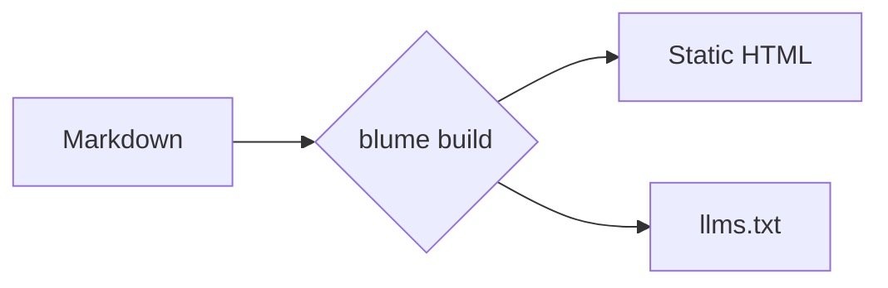
````

Os diagramas são renderizados no cliente, então este é um recurso exclusivo do MDX, e a biblioteca Mermaid é carregada apenas em páginas que incluem um; um site sem nenhum diagrama nem chega a enviá-la. Por padrão, os diagramas usam o layout dagre e o visual clássico do Mermaid; ative outro layout ou visual em um único diagrama pelo front matter do Mermaid (um bloco `config:` com `layout: elk` ou `look: neo`), e o motor ELK é carregado apenas para os diagramas que o solicitarem. Um diagrama que o Mermaid não consegue interpretar mostra "Não foi possível renderizar este diagrama." no lugar dele; o erro do parser do Mermaid, com a linha em que ele parou, vai para o console do navegador, e o `blume dev` também o exibe abaixo da mensagem. O restante desta seção é uma galeria de tipos comuns — veja a [documentação do Mermaid](https://mermaid.js.org/intro/) para a lista completa.

### Fluxograma [#flowchart]


### Diagrama de sequência [#sequence-diagram]

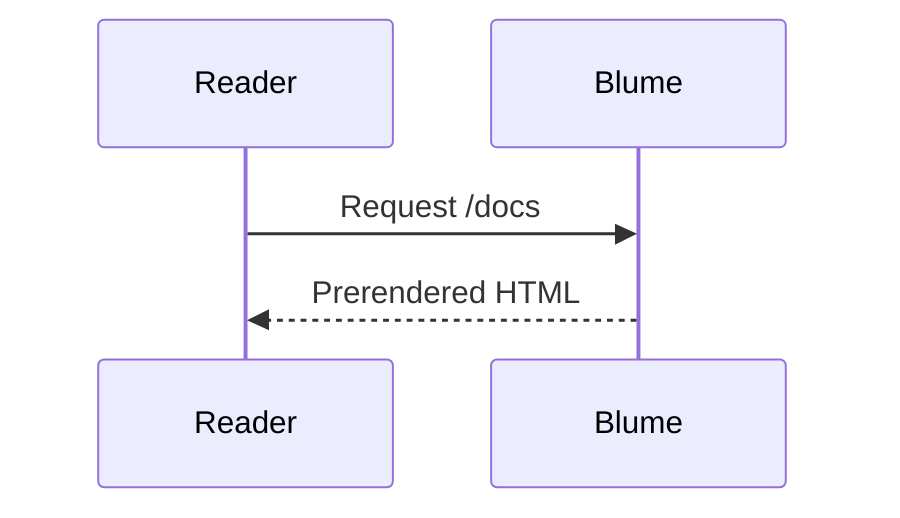

### Diagrama de classes [#class-diagram]

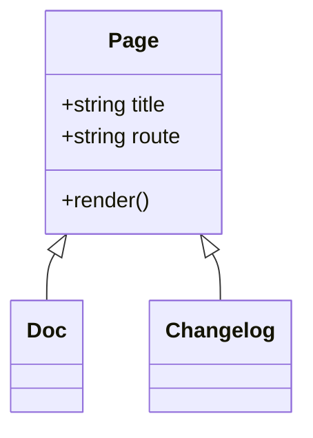

### Diagrama de estados [#state-diagram]

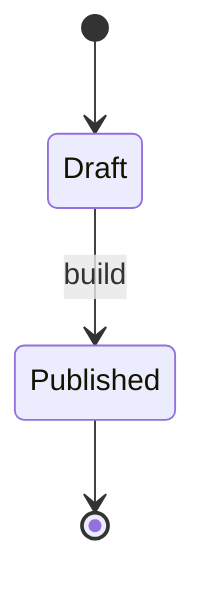

### Entidade-relacionamento [#entity-relationship]

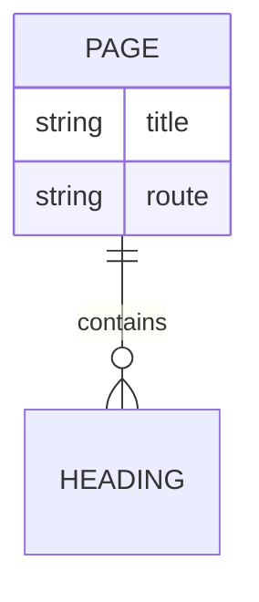

### Jornada do usuário [#user-journey]

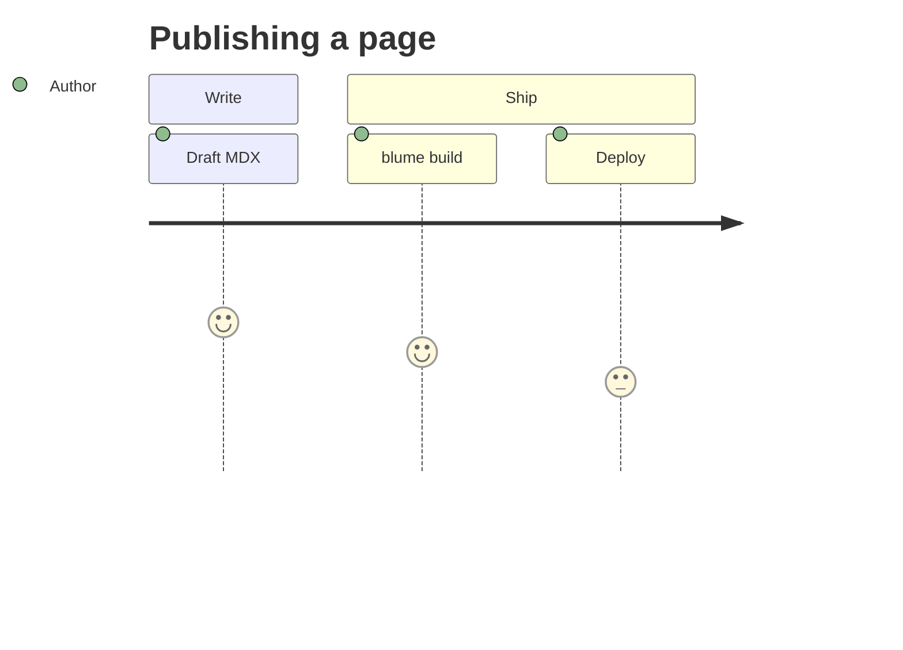

### Gantt

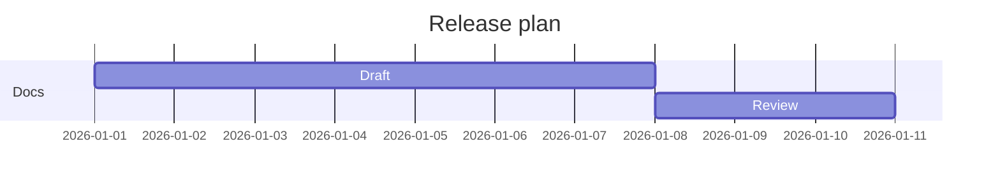

### Grafo do Git [#git-graph]

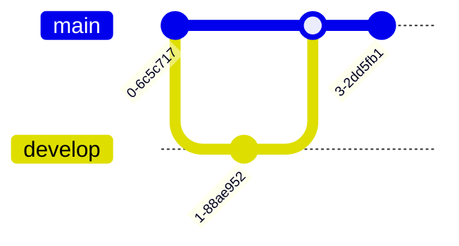

### Gráfico de pizza [#pie-chart]

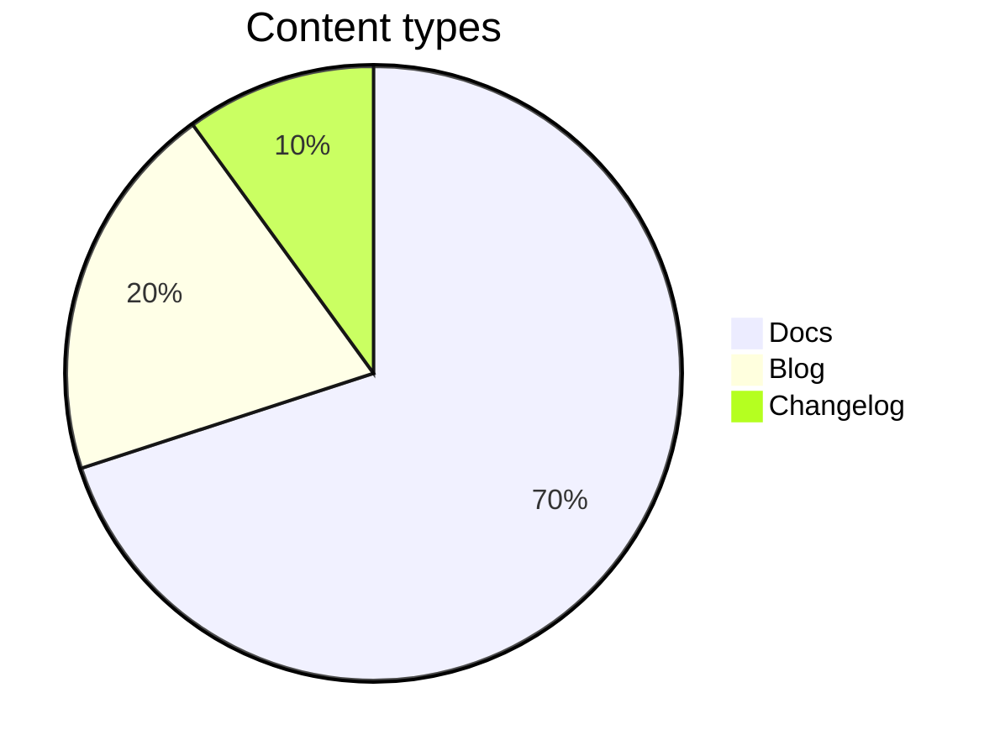

### Mapa mental [#mindmap]

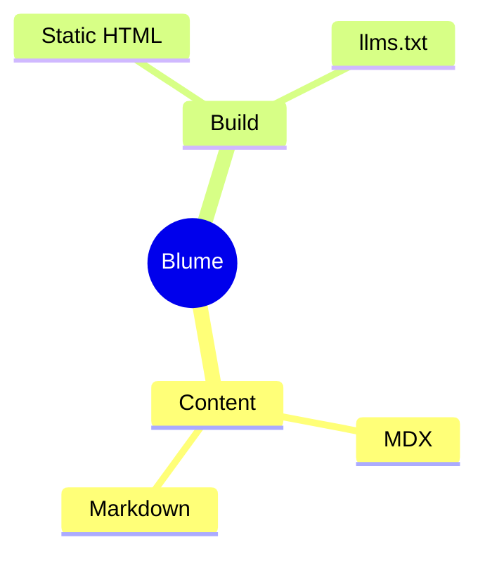

### Linha do tempo [#timeline]

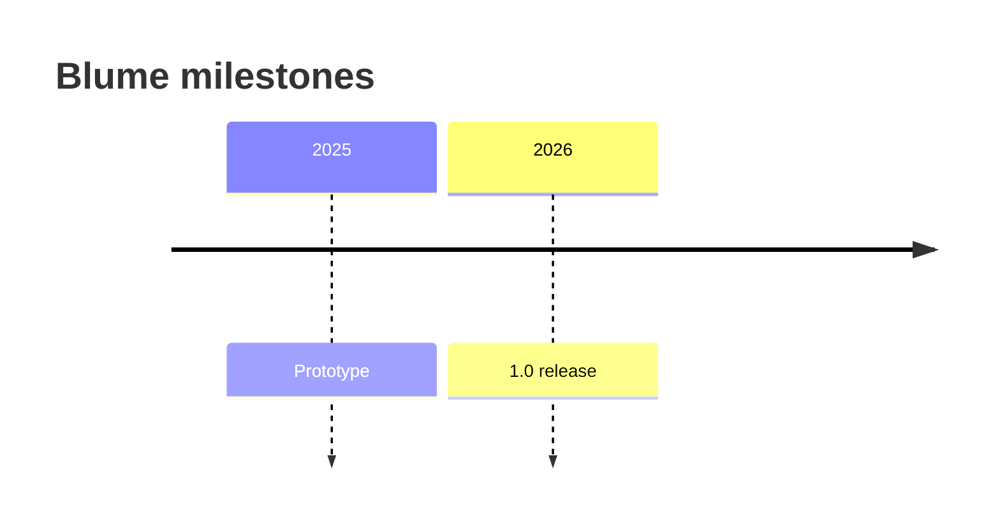

## Avisos [#callouts]

Os avisos chamam a atenção do leitor para contexto, conselhos ou riscos. Escreva-os como diretivas `:::type`; adicione um título entre colchetes, como `:::warning[Heads up]`. O título mantém sua formatação inline, então código, ênfase e links dentro dos colchetes são renderizados no título. As diretivas são um recurso exclusivo do MDX — em um arquivo `.md` uma linha `:::note` permanece como texto literal, e o `blume dev`, o `blume build` e o `blume check` alertam sobre isso como `BLUME_MD_DIRECTIVE`. Renomeie a página para `.mdx` para que a diretiva seja renderizada como um aviso.

### Nota [#note]

Contexto neutro e complementar que o leitor deve ter em mente.

:::note
O Blume regenera `.blume/` a cada execução — nunca o edite manualmente.
:::

```md
:::note
Blume regenerates `.blume/` on every run — never edit it by hand.
:::
```

### Dica [#tip]

Um atalho útil ou uma boa prática que não é obrigatória, mas facilita a vida.

:::tip
Defina `deployment.site` para que os sitemaps e as imagens do Open Graph usem URLs absolutas.
:::

```md
:::tip
Set `deployment.site` so sitemaps and Open Graph images use absolute URLs.
:::
```

### Sucesso [#success]

Confirme um resultado positivo ou que uma etapa foi concluída como esperado.

:::success
Sua documentação foi compilada com sucesso e está pronta para publicação.
:::

```md
:::success
Your docs built successfully and are ready to deploy.
:::
```

### Aviso [#warning]

Sinalize algo que exige cuidado para evitar um erro ou comportamento inesperado.

:::warning[Atenção]
A saída de servidor precisa de um adaptador de host do `blume/deploy` antes que você possa publicar.
:::

```md
:::warning[Heads up]
Server output needs a host adapter from `blume/deploy` before you can deploy.
:::
```

### Perigo [#danger]

Destaque uma ação destrutiva ou disruptiva que não pode ser desfeita com facilidade.

:::danger
`blume eject` é um passo sem volta — o projeto Astro gerado passa a ser seu.
:::

```md
:::danger
`blume eject` is a one-way step — the generated Astro project becomes yours.
:::
```

### Info

Um aparte informativo; um padrão flexível quanto a aliases que soa neutro.

:::info
O tema principal não envia nenhum JS de framework do lado do cliente.
:::

```md
:::info
The core theme ships no client framework JS.
:::
```

Os nomes `caution`, `error`, `important` e `warn` são aceitos como aliases de `warning`, `danger`, `note` e `warning`, respectivamente.

Qualquer outro nome não é um aviso. O conteúdo dele continua sendo renderizado — entre as linhas `:::`, que permanecem na página como foram escritas — então um `:::details` trazido de outra ferramenta de documentação, ou um erro de digitação como `:::warnig`, nunca esconde o que está dentro dele. O `blume dev`, o `blume build` e o `blume check` alertam sobre isso como `BLUME_UNKNOWN_DIRECTIVE`, listando os tipos de aviso acima.

Para colocar um aviso dentro de outro, dê ao externo uma cerca mais longa:

```md
::::note
Blume regenerates `.blume/` on every run.

:::tip
Commit `blume.config.ts`, not `.blume/`.
:::
::::
```

Escreva o nome logo depois dos dois-pontos. `::: tip`, com um espaço (a grafia que o VitePress, o VuePress e o Docusaurus v2 usam), não é uma diretiva, então a página mostra a linha como texto, e o Blume alerta sobre um nome de aviso escrito dessa forma como `BLUME_DIRECTIVE_SPACED_NAME`. O título vai entre colchetes: um texto depois do nome, como em `:::tip Some title`, abre o aviso, mas nunca aparece, e o Blume alerta sobre isso como `BLUME_DIRECTIVE_OPENING_TEXT`, indicando a grafia com colchetes, `:::tip[Some title]`. Dentro de um contêiner, uma cerca de fechamento com texto depois dos dois-pontos ainda o fecha, e o texto é descartado: uma linha `::: card` dentro de um `:::warning` encerra o aviso ali, e `card` nunca aparece. O Blume alerta sobre essa linha como `BLUME_DIRECTIVE_CLOSING_TEXT`. Para mantê-la dentro do aviso como texto, dê ao aviso uma cerca mais longa, como acima, ou remova o texto depois dos dois-pontos.

### Alertas do GitHub [#github-alerts]

A sintaxe de alertas do GitHub também é renderizada como um aviso: uma citação cuja primeira linha seja `[!NOTE]`, `[!TIP]`, `[!IMPORTANT]`, `[!WARNING]` ou `[!CAUTION]`, em maiúsculas ou minúsculas. O texto depois do marcador nessa linha vira o título.

{/* prettier-ignore */}
> [!TIP]
> Defina `deployment.site` para que os sitemaps e as imagens do Open Graph usem URLs absolutas.

{/* prettier-ignore */}
```md
> [!TIP]
> Set `deployment.site` so sitemaps and Open Graph images use absolute URLs.
```

`[!NOTE]` e `[!TIP]` são renderizados como os avisos de mesmo nome, `[!IMPORTANT]` como Nota, `[!WARNING]` como Aviso e `[!CAUTION]` como Perigo, combinando com o vermelho do GitHub. Assim como no GitHub, um alerta citado dentro de outro continua sendo uma citação, e o mesmo vale para qualquer outro marcador, como `[!INFO]`.

Um formatador que junta linhas, como o oxfmt com `proseWrap: "never"`, puxa a primeira linha do corpo para o lado do marcador, onde ela vira o título (ele [colapsa diretivas](/docs/faq#why-is-oxfmt--ultracite-collapsing-my-directives) da mesma forma). Deixe uma linha `>` em branco depois do marcador para mantê-los separados; o GitHub também renderiza essa forma.

Os alertas são exclusivos do MDX, como as diretivas. Em um arquivo `.md` a citação continua sendo uma citação e mostra seu marcador como texto, e o `blume dev`, o `blume build` e o `blume check` alertam sobre isso como `BLUME_MD_GITHUB_ALERT`. Renomeie a página para `.mdx` para que o alerta seja renderizado como um aviso.

## Matemática [#math]

Renderize LaTeX com o KaTeX, útil para documentação científica ou com muita matemática. Coloque `$$…$$` em linhas próprias para um bloco centralizado:

$$
\int_0^\infty e^{-x^2}\,dx = \frac{\sqrt{\pi}}{2}
$$

```md
$$
a^2 + b^2 = c^2
$$
```

Ou escreva `$$…$$` dentro de uma frase para matemática inline, como a identidade de Euler $$e^{i\pi} + 1 = 0$$:

```md
Like Euler's identity $$e^{i\pi} + 1 = 0$$.
```

:::note
A matemática está ativa automaticamente: escreva `$$…$$` e ela é renderizada; não escreva nenhuma e a folha de estilo do KaTeX nunca é enviada. Tanto a matemática em bloco quanto a inline usam dois cifrões. Um `$` isolado (moeda, variáveis de shell, código) é sempre texto literal, então "$5 e $10" nunca vira matemática, e não há delimitador para escapar nem configuração para alternar. A matemática é um recurso exclusivo do MDX. Os nomes de classe dentro da marcação renderizada (`.katex-html`, `.katex-base`, …) são internos do próprio KaTeX, não um contrato de estilização que o Blume mantém — eles podem mudar quando o KaTeX for atualizado, então mire no wrapper `.katex-display` para estilos personalizados.
:::

## Pontuação inteligente [#smart-punctuation]

O Blume converte aspas retas e traços em equivalentes tipográficos enquanto você escreve, para que o texto pareça diagramado — sem exigir caracteres especiais.

"Aspas" ficam curvas, -- vira um travessão curto, --- um travessão longo e ... uma reticência.

```md
"Quotes" become curly, -- becomes an en dash, --- an em dash, and ... an ellipsis.
```

## Sintaxe de outras ferramentas [#syntax-from-other-tools]

O Blume lê a sintaxe desta página e nada além dela. Sintaxe que outra ferramenta de documentação lê aparece na página como foi escrita, ou quebra uma página `.mdx` quando ela é renderizada, então o `blume dev`, o `blume build` e o `blume check` alertam sobre ela na linha em que aparece. Blocos de código, código inline e comentários são ignorados, então coloque um exemplo em código inline para exibi-lo como texto.

- `BLUME_TEMPLATE_TAG`: uma tag do Liquid ou do Markdoc (``, ``) ou uma saída do Liquid (`{{ site.title }}`) em uma página `.md`. O Blume não executa nenhuma linguagem de template, então substitua a tag pelo que ela produzia, e um valor usado no site inteiro por uma [variável](/docs/content/variables). Um `{{name}}` que poderia ser uma variável não é reportado aqui.
- `BLUME_WIKILINK_UNSUPPORTED`: um wiki link (`[[Home]]`, `[[Text|Page]]`) que nomeia uma das páginas do site pelo nome do arquivo ou pelo título, ou qualquer wiki link com um `|`. Somente uma fonte de [vault do Obsidian](/docs/content/sources/obsidian) lê wiki links. O alerta indica o link Markdown que o substitui.
- `BLUME_MDC_SYNTAX`: um componente de bloco (`::callout` … `::`) ou componente inline (`:badge[New]{color="primary"}`) do Nuxt Content (MDC). Use o [componente](/docs/content/components) correspondente ou um aviso `:::` no lugar.
- `BLUME_MDX_ATTRIBUTE_LIST`: uma lista de atributos (`{ width="300" }`, `{: .note }`) em uma página `.mdx`. O MDX lê as chaves como JavaScript, então o build da página falha. Defina os atributos em um elemento JSX (``) e fixe a âncora de um título com `[#id]`.
- `BLUME_MD_ATTRIBUTE_LIST`: uma lista de atributos em uma página `.md`, como o `{: .note }` ou `{: #intro }` do kramdown em uma linha própria ou depois de um bloco, ou `{ width="300" }` depois de uma imagem. A página a exibe como foi escrita. Defina os atributos em um elemento HTML (``) e fixe a âncora de um título com `[#id]`. O marcador `{#id}` de um título é coberto pelo [`BLUME_MD_CURLY_ANCHOR`](#custom-anchors).
- `BLUME_MDX_UNCLOSED_ELEMENT`: um elemento HTML vazio (void) sem a barra de fechamento (``, `<br>`) em uma página `.mdx`, ou em um partial que uma página `.mdx` [inclui](/docs/content/includes). O MDX o interpreta como um elemento JSX não fechado, então feche-o: `<br />`.
